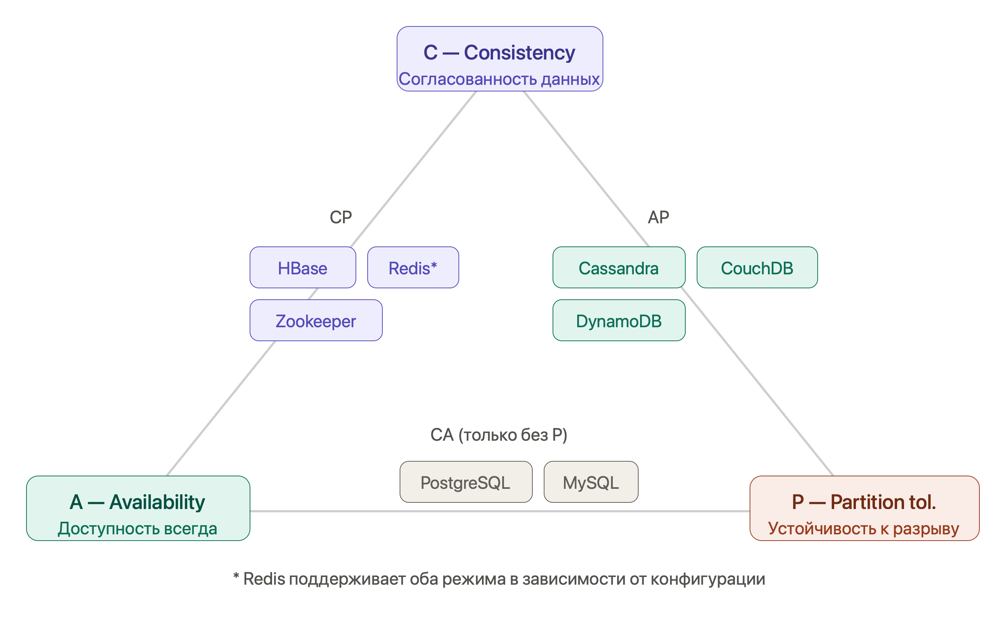

# NoSQL

## Зачем NoSQL, если есть SQL?

Реляционные БД отлично работают для структурированных данных с чёткими связями. Но у них есть ограничения, которые в определённых сценариях становятся критичными:

- **Жёсткая схема** — добавить поле означает миграцию таблицы. Для продуктов с частыми изменениями это боль.
- **Вертикальное масштабирование** — нагрузку снимают более мощным сервером. Горизонтальное (шардирование) есть, но сложное.
- **Мощь не нужна** — если хранишь сессии пользователей, кэш или очередь событий, реляционная модель избыточна.
- **Неструктурированные данные** — JSON-документы разной структуры, графы, временные ряды плохо ложатся в таблицы.

NoSQL (Not Only SQL) — не замена SQL, а другой инструмент под другие задачи.

## Четыре семейства NoSQL

### 1. Document Store — документные БД

**Суть:** Данные хранятся как JSON/BSON документы. Нет фиксированной схемы — каждый документ может иметь разные поля.

**Представители:** MongoDB, CouchDB, Firestore.

```json
// Документ "habit" в MongoDB
{
  "_id": "64a1f2c3d4e5f6a7b8c9d0e1",
  "userId": "user_42",
  "name": "Утренняя пробежка",
  "frequency": "daily",
  "reminders": [
    { "time": "07:00", "enabled": true },
    { "time": "07:30", "enabled": false }
  ],
  "streaks": {
    "current": 14,
    "longest": 30
  },
  "tags": ["здоровье", "спорт"],
  "createdAt": "2024-01-15T07:00:00Z"
}
```

**Spring Data MongoDB:**

```java
@Document(collection = "habits")
public class Habit {
    @Id
    private String id;
    private String userId;
    private String name;
    private List<Reminder> reminders;
    private Map<String, Integer> streaks;

    // Вложенный объект — просто поле, никаких JOIN-ов
    @Document
    public record Reminder(String time, boolean enabled) {}
}

public interface HabitRepository extends MongoRepository<Habit, String> {

    List<Habit> findByUserId(String userId);

    // MongoDB Query
    @Query("{ 'userId': ?0, 'streaks.current': { $gte: ?1 } }")
    List<Habit> findActiveStreaks(String userId, int minDays);
}
```

**Когда выбирать:**
- Данные имеют переменную структуру (каталог товаров где у каждого свои атрибуты)
- Нужно хранить вложенные объекты без нормализации
- Частые изменения схемы (стартап, быстрые итерации)
- Чтение целого документа чаще, чем отдельных полей

**Когда НЕ выбирать:**
- Сложные связи между сущностями (придётся делать JOIN в коде)
- Нужны ACID-транзакции через несколько документов (MongoDB 4.0+ поддерживает, но дороже)
- Данные высоко нормализованы и структурированы

---

### 2. Key-Value Store — хранилища "ключ-значение"

**Суть:** Максимально простая модель: ключ → значение. БД не знает что внутри значения. Скорость операций — O(1).

**Представители:** Redis, DynamoDB, Memcached.

**Redis** — самый популярный. Данные в памяти (in-memory), опциональная персистентность, богатые типы данных.

```java
// Spring Data Redis
@Configuration
public class RedisConfig {
    @Bean
    public RedisTemplate<String, Object> redisTemplate(RedisConnectionFactory factory) {
        RedisTemplate<String, Object> template = new RedisTemplate<>();
        template.setConnectionFactory(factory);
        template.setValueSerializer(new GenericJackson2JsonRedisSerializer());
        return template;
    }
}

@Service
public class HabitCacheService {

    private final RedisTemplate<String, Object> redis;
    private static final Duration TTL = Duration.ofMinutes(30);

    // Простой кэш
    public void cacheHabit(String habitId, HabitDto habit) {
        redis.opsForValue().set("habit:" + habitId, habit, TTL);
    }

    public HabitDto getCachedHabit(String habitId) {
        return (HabitDto) redis.opsForValue().get("habit:" + habitId);
    }

    // Счётчик streak (атомарная операция)
    public long incrementStreak(String userId, String habitId) {
        String key = "streak:" + userId + ":" + habitId;
        return redis.opsForValue().increment(key);
    }

    // Хранение сессии пользователя
    public void saveSession(String sessionId, UserSession session, Duration ttl) {
        redis.opsForValue().set("session:" + sessionId, session, ttl);
    }

    // Очередь задач (List)
    public void pushNotification(String userId, NotificationDto notification) {
        redis.opsForList().leftPush("notifications:" + userId, notification);
    }

    public NotificationDto popNotification(String userId) {
        return (NotificationDto) redis.opsForList().rightPop("notifications:" + userId);
    }

    // Уникальные просмотры (Set)
    public void trackView(String habitId, String userId) {
        redis.opsForSet().add("views:" + habitId, userId);
    }

    public long uniqueViewCount(String habitId) {
        return redis.opsForSet().size("views:" + habitId);
    }

    // Топ привычек по streak (Sorted Set)
    public void updateLeaderboard(String userId, double streak) {
        redis.opsForZSet().add("leaderboard", userId, streak);
    }

    public Set<Object> getTopUsers(int count) {
        return redis.opsForZSet().reverseRange("leaderboard", 0, count - 1);
    }
}
```

**Типы данных Redis:**

| Тип | Команды | Применение |
|---|---|---|
| **String** | GET, SET, INCR, EXPIRE | Кэш, счётчики, сессии |
| **List** | LPUSH, RPOP, LRANGE | Очереди, история, лента |
| **Set** | SADD, SMEMBERS, SINTER | Уникальные элементы, теги |
| **Sorted Set** | ZADD, ZRANGE, ZRANK | Лидерборды, приоритеты |
| **Hash** | HSET, HGET, HGETALL | Объекты с полями |
| **Stream** | XADD, XREAD | Event sourcing, логи |

**Когда выбирать:**
- Кэширование (самый частый кейс)
- Сессии пользователей
- Rate limiting (счётчик запросов с TTL)
- Очереди задач
- Pub/Sub (уведомления в реальном времени)
- Лидерборды и рейтинги

---

### 3. Wide-Column Store — колоночные БД

**Суть:** Данные хранятся по столбцам, а не по строкам. Таблицы есть, но схема гибкая — строки в одной таблице могут иметь разные столбцы. Спроектированы для огромных объёмов данных и горизонтального масштабирования.

**Представители:** Apache Cassandra, HBase, Amazon Keyspaces.

```sql
-- Cassandra CQL (похож на SQL, но другая семантика)
CREATE TABLE habit_events (
    user_id     UUID,
    habit_id    UUID,
    event_date  DATE,
    event_time  TIMESTAMP,
    completed   BOOLEAN,
    notes       TEXT,
    PRIMARY KEY ((user_id, habit_id), event_date, event_time)
) WITH CLUSTERING ORDER BY (event_date DESC, event_time DESC);

-- Partition key: (user_id, habit_id) — определяет на какой ноде лежат данные
-- Clustering key: event_date, event_time — порядок внутри партиции

-- Запрос: ОБЯЗАТЕЛЬНО по partition key
SELECT * FROM habit_events
WHERE user_id = ? AND habit_id = ?
AND event_date >= '2024-01-01';

-- ❌ Так нельзя — нет фильтрации по partition key
SELECT * FROM habit_events WHERE completed = true;
```

**Spring Data Cassandra:**

```java
@Table("habit_events")
public class HabitEvent {
    @PrimaryKeyColumn(name = "user_id", type = PrimaryKeyType.PARTITIONED, ordinal = 0)
    private UUID userId;

    @PrimaryKeyColumn(name = "habit_id", type = PrimaryKeyType.PARTITIONED, ordinal = 1)
    private UUID habitId;

    @PrimaryKeyColumn(name = "event_date", type = PrimaryKeyType.CLUSTERED, ordinal = 0,
                      ordering = Ordering.DESCENDING)
    private LocalDate eventDate;

    @Column private boolean completed;
    @Column private String notes;
}
```

**Главное правило Cassandra:** Проектируй схему вокруг запросов, а не вокруг данных. В реляционных БД — нормализация, потом запросы. В Cassandra — сначала запросы, потом схема.

!!! warning "Чего нет в Cassandra"
    Нет JOIN. Нет агрегаций типа SUM/AVG/GROUP BY в традиционном смысле. Нет транзакций через несколько партиций (только lightweight transactions в одной партиции). Это не баг — это намеренный выбор в пользу скорости и масштабируемости.

**Когда выбирать:**
- Огромные объёмы данных (терабайты, петабайты)
- Высокая скорость записи (IoT, логи, метрики, события)
- Временные ряды (история показателей, события с временной меткой)
- Нужна линейная горизонтальная масштабируемость

---

### 4. Graph Database — графовые БД

**Суть:** Данные — это узлы (nodes) и рёбра (edges/relationships). Рёбра — первоклассные граждане, хранятся явно с атрибутами. Идеально для связанных данных.

**Представители:** Neo4j, Amazon Neptune, JanusGraph.

```cypher
// Cypher — язык запросов Neo4j

// Создаём узлы и связи
CREATE (alice:User {id: 1, name: 'Alice'})
CREATE (bob:User {id: 2, name: 'Bob'})
CREATE (running:Habit {id: 10, name: 'Бег'})
CREATE (alice)-[:FOLLOWS]->(bob)
CREATE (alice)-[:PRACTICES {since: '2024-01-01', streak: 14}]->(running)
CREATE (bob)-[:PRACTICES {since: '2024-02-01', streak: 5}]->(running)

// Найти все привычки друзей Alice
MATCH (alice:User {name: 'Alice'})-[:FOLLOWS]->(friend:User)-[:PRACTICES]->(habit:Habit)
RETURN friend.name, habit.name, friend.streak

// Рекомендации: привычки, которые практикуют люди с похожими интересами
MATCH (me:User {id: $userId})-[:PRACTICES]->(habit:Habit)<-[:PRACTICES]-(other:User)
      -[:PRACTICES]->(recommended:Habit)
WHERE NOT (me)-[:PRACTICES]->(recommended)
RETURN recommended.name, COUNT(other) AS popularity
ORDER BY popularity DESC
LIMIT 5

// Кратчайший путь между пользователями
MATCH path = shortestPath((alice:User {name:'Alice'})-[:FOLLOWS*]-(bob:User {name:'Bob'}))
RETURN path, length(path)
```

**Когда выбирать:**
- Социальные графы (друзья, подписчики, рекомендации)
- Системы рекомендаций
- Обнаружение мошенничества (цепочки транзакций)
- Карты и маршруты
- Иерархические структуры (орг. структура компании)
- Управление зависимостями (граф зависимостей пакетов)

---

## CAP-теорема — главный компромисс



Теорема Брюера (CAP) говорит: в распределённой системе можно гарантировать **только два** из трёх свойств одновременно.

```
        C (Consistency)
       Согласованность
       Все узлы видят
       одинаковые данные
            △
           / \
          /   \
         /     \
        /       \
       ◇─────────◇
 A (Availability)    P (Partition tolerance)
   Доступность        Устойчивость к разделению
   Каждый запрос      Система работает даже если
   получает ответ     узлы не могут общаться
```

**CA (без P)** — нет смысла в реальных распределённых системах: сеть всегда может упасть. Это традиционные RDBMS на одном сервере.

**CP (без A)** — при разрыве сети система предпочтёт вернуть ошибку, чем устаревшие данные. **HBase, Zookeeper, Redis (в режиме CP).**

**AP (без C)** — при разрыве сети система продолжит работу, но может отдавать устаревшие данные. **Cassandra, CouchDB, DynamoDB.**

!!! tip "PACELC — более реалистичная модель"
    CAP описывает поведение только при сетевом разделении (P). Но большую часть времени сеть работает! PACELC добавляет: даже без разделения есть компромисс между **Latency (задержка)** и **Consistency (согласованность)**. Cassandra позволяет настраивать уровень согласованности на уровне запроса через `ConsistencyLevel`.

---

## Сравнительная таблица

| | **Document** | **Key-Value** | **Wide-Column** | **Graph** |
|---|---|---|---|---|
| **Пример** | MongoDB | Redis | Cassandra | Neo4j |
| **Модель данных** | JSON документы | Пары ключ-значение | Строки с динамическими столбцами | Узлы и рёбра |
| **Схема** | Гибкая | Нет | Гибкая | Гибкая |
| **Запросы** | По любому полю | Только по ключу | По partition key | Обход графа |
| **Масштабирование** | Горизонтальное | Горизонтальное | Линейное горизонтальное | Вертикальное (Neo4j) |
| **ACID** | Частично (4.0+) | Частично (транзакции) | Нет (LWT в партиции) | Да |
| **CAP** | CP или AP | CP | AP | CA |
| **Лучший кейс** | Каталоги, CMS | Кэш, сессии, очереди | IoT, логи, события | Соцсети, рекомендации |

---

## Паттерны использования NoSQL в Spring Boot

### Кэш-сквозной (Cache-Aside)

```java
@Service
public class HabitService {

    private final HabitRepository habitRepository;     // PostgreSQL
    private final HabitCacheService cacheService;      // Redis

    public HabitDto findById(String id) {
        // 1. Проверяем кэш
        HabitDto cached = cacheService.getCachedHabit(id);
        if (cached != null) return cached;

        // 2. Промах — идём в БД
        HabitDto habit = habitRepository.findById(id)
            .map(HabitMapper::toDto)
            .orElseThrow(() -> new HabitNotFoundException(id));

        // 3. Кладём в кэш для следующих запросов
        cacheService.cacheHabit(id, habit);
        return habit;
    }

    public HabitDto update(String id, HabitUpdateDto dto) {
        HabitEntity entity = habitRepository.findById(id).orElseThrow();
        entity.setName(dto.name());
        habitRepository.save(entity);

        // Инвалидируем кэш после обновления
        cacheService.evictHabit(id);
        return HabitMapper.toDto(entity);
    }
}
```

### Полиглотная персистентность (Polyglot Persistence)

Разные данные хранить там, где они хранятся лучше всего:

```java
@Service
public class HabitTrackerService {

    private final HabitJpaRepository postgresRepo;    // Основные данные (PostgreSQL)
    private final HabitEventRepository cassandraRepo; // История событий (Cassandra)
    private final RedisTemplate<String, Object> redis; // Кэш и сессии (Redis)
    private final MongoTemplate mongo;                 // Аналитика и отчёты (MongoDB)

    public void recordHabitCompletion(String userId, String habitId) {
        // Обновляем streak в PostgreSQL (транзакция)
        postgresRepo.incrementStreak(userId, habitId);

        // Записываем событие в Cassandra (масштабируемая история)
        cassandraRepo.save(new HabitEvent(userId, habitId, LocalDateTime.now(), true));

        // Обновляем Redis (кэш + лидерборд)
        redis.opsForValue().increment("streak:" + userId + ":" + habitId);
        redis.opsForZSet().incrementScore("leaderboard:" + habitId, userId, 1);

        // Сбрасываем кэш профиля
        redis.delete("profile:" + userId);
    }
}
```

### Rate Limiting через Redis

```java
@Component
public class RateLimiter {

    private final RedisTemplate<String, String> redis;

    public boolean isAllowed(String userId, String endpoint, int maxRequests, Duration window) {
        String key = "rate:" + userId + ":" + endpoint;

        Long count = redis.opsForValue().increment(key);

        if (count == 1) {
            // Первый запрос — устанавливаем TTL окна
            redis.expire(key, window);
        }

        return count <= maxRequests;
    }
}

// Использование в фильтре:
// isAllowed("user_42", "/api/habits", 100, Duration.ofMinutes(1))
// → true пока запросов ≤ 100 в минуту, потом false
```

---

## Итоговая шпаргалка

| **Тема** | **Запомнить** |
|---|---|
| **NoSQL vs SQL** | Не замена, а другой инструмент. Гибкая схема, горизонтальное масштабирование, специализация |
| **Document** | JSON-документы, гибкая схема. MongoDB. Каталоги, CMS, данные с переменной структурой |
| **Key-Value** | O(1) по ключу. Redis. Кэш, сессии, счётчики, очереди, лидерборды |
| **Wide-Column** | Проектируй под запросы. Cassandra. IoT, логи, временные ряды, огромные объёмы |
| **Graph** | Узлы и рёбра — первоклассные граждане. Neo4j. Соцсети, рекомендации, мошенничество |
| **CAP** | C + P = HBase. A + P = Cassandra. Реальных CA нет в распределённых системах |
| **Redis типы** | String (кэш), List (очередь), Set (уникальные), ZSet (рейтинг), Hash (объект), Stream (события) |
| **Cassandra правило** | Partition key обязателен в запросе. Схема = запросы, не данные |
| **Cache-Aside** | Читай из кэша → промах → БД → положи в кэш → инвалидируй при обновлении |
| **Polyglot** | Разные данные в разных БД. PostgreSQL + Redis + Cassandra — нормально |