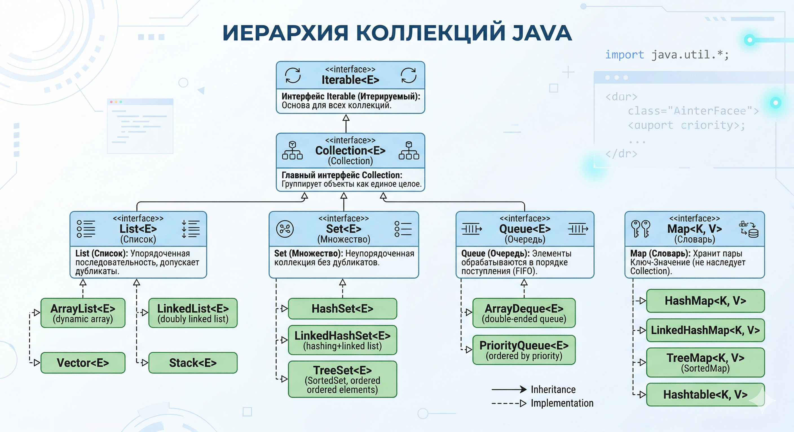

# Collections

## Иерархия коллекций и базовые интерфейсы



### 1. Вершина эволюции: `Iterable` и `Collection`

Вся иерархия начинается с интерфейса **`Iterable`**. У него всего одна главная задача: он говорит JVM, что _"по этому объекту можно пройтись в цикле `for-each`"_. Он возвращает `Iterator`, который умеет шагать по элементам (`hasNext()`, `next()`).

От него наследуется интерфейс **`Collection`**. Это базовый контракт для группы элементов. Он добавляет фундаментальные методы, которые должны уметь делать все стандартные коллекции: `add()`, `remove()`, `size()`, `contains()`, `clear()`.

### 2. Главный вопрос с подвохом: Почему `Map` — это не `Collection`?

На собеседовании обязательно спросят: _"Почему `List` и `Set` наследуются от `Collection`, а `Map` стоит особняком?"_

Ответ кроется в **Принципе разделения интерфейсов (Interface Segregation из SOLID)**:

- `Collection` оперирует **одиночными элементами** (Values). Ее базовый метод: `add(Element e)`.
- `Map` оперирует **парами** (Key → Value). Ее базовый метод: `put(Key k, Value v)`.

Если бы разработчики Java заставили `Map` унаследоваться от `Collection`, им пришлось бы реализовать метод `add(Element)`. А что он должен был бы делать в мапе? Каким был бы ключ? Это сломало бы всю логику структуры данных. Поэтому `Map` — это абсолютно независимая ветка со своим интерфейсом.

### 3. Большая тройка коллекций: `List`, `Set` и `Queue`

От интерфейса `Collection` отходят три главные ветки. Каждая из них добавляет свои уникальные правила к базовому контракту.

**`List` (Список) — Контракт порядка и индексов**

- Элементы хранятся строго в том порядке, в котором их добавили.
- У каждого элемента есть порядковый номер (индекс). Появляются методы вроде `get(int index)`.
- Дубликаты разрешены.
- _Пример:_ История отметок пользователя за неделю строго по дням.

**`Set` (Множество) — Контракт уникальности**

- В коллекции не может быть двух одинаковых элементов.
- Нет индексов и (в большинстве реализаций) нет гарантии сохранения порядка добавления.
- Если попытаться добавить элемент, который там уже есть, метод `add()` просто вернет `false`.
- _Пример:_ Хранение списка уникальных названий привычек.

**`Queue` (Очередь) — Контракт обработки**

- Элементы хранятся в порядке, в котором они должны быть обработаны (обычно FIFO — First In, First Out).
- Специальные методы: `offer()` (безопасное добавление), `poll()` (достать и удалить из начала), `peek()` (просто посмотреть на первый, не удаляя).
- _Пример:_ Очередь отправки push-уведомлений.

### 4. Засада с `equals()` и `hashCode()`

Без правильного переопределения этих методов структуры данных, основанные на хэшировании (`HashSet`, `HashMap`), **просто сломаются логически**.

**Практический сценарий:** Есть класс `Habit`. Создаем два объекта и добавляем в `HashSet`:

```java
Habit h1 = new Habit("Бег");
Habit h2 = new Habit("Бег");
set.add(h1);
set.add(h2);
```

- **Если НЕ переопределил `equals()` и `hashCode()`:** `HashSet` посмотрит на адреса в памяти (они разные — два вызова `new`), посчитает хэши от адресов и положит объекты в разные корзины. В итоге в `Set` окажется **два логически одинаковых объекта**. Контракт уникальности нарушен!
- **Если ПЕРЕОПРЕДЕЛИЛ:** `HashSet` вычислит одинаковый хэш-код (строка "Бег" одинаковая), сравнит объекты через `equals()` и вернет `false`. Дубликат не добавится.

!!! tip "Золотое правило"
    Если объект планируется использовать в качестве ключа в `Map` или элемента в `Set`, переопределение `equals()` и `hashCode()` **обязательно**.

## Списки (Lists): ArrayList vs LinkedList

### 1. Устройство `ArrayList` под капотом (Динамический массив)

`ArrayList` — это умная обертка над самым обычным массивом `Object[]`.

- **Как он создается:** `new ArrayList<>()` создает пустой массив. При добавлении первого элемента массив инициализируется дефолтным размером (Capacity) — **10 элементов**.
- **Динамическое расширение (Resizing):** Что делает `ArrayList`, когда ты пытаешься добавить 11-й элемент?
    1. Создается абсолютно **новый массив**.
    2. Размер вычисляется по формуле: `oldCapacity + (oldCapacity >> 1)` — битовый сдвиг вправо на 1 — это деление на 2. Массив увеличивается **в 1.5 раза** (16 → 24 → 36...).
    3. Старый массив копируется в новый через нативный `System.arraycopy()`.
    4. Старый массив уходит в Garbage Collector.
- **Сложность доступа:** `get(index)` работает за **O(1)**, так как адреса в массиве вычисляются мгновенно.

### 2. Устройство `LinkedList` под капотом (Двусвязный список)

`LinkedList` — цепочка независимых объектов-узлов (`Node`). Никакого единого массива внутри.

- **Каждый узел хранит:** сами данные (`item`), ссылку на **следующий** узел (`next`), ссылку на **предыдущий** узел (`prev`).
- **Сложность доступа:** Чтобы найти 500-й элемент, `LinkedList` вынужден начать с головы (или хвоста) и последовательно перебирать узлы. Доступ по индексу — **O(n)**.

### 3. Разрушение мифа о вставке в середину

Интервьюер задает классический вопрос: _"Мне нужно вставить элемент в середину списка из миллиона элементов. Что быстрее: `ArrayList` или `LinkedList`?"_

Ожидаемый неверный ответ джуна: _"Конечно `LinkedList`! Вставка O(1), просто перекинем ссылки. А `ArrayList` сдвинет полмиллиона элементов — O(n)."_

**Ответ сеньора — почему `ArrayList` победит:**

1. **Проблема поиска узла:** Сама операция вставки в `LinkedList` — O(1). Но чтобы добраться до середины, нужно сначала её **найти** — а это O(n) перебора.
2. **Скорость сдвига массива:** `ArrayList` сдвигает элементы через `System.arraycopy()`. Это низкоуровневая команда на C++, которая перемещает гигантские блоки памяти разом. Практически — в сотни раз быстрее перебора узлов.

### 4. Магия кэша процессора (Cache Locality)

Произнеси фразу **"Cache Locality"** на интервью — это сразу покажет понимание архитектуры "железа".

- Процессоры читают из RAM не по одному байту, а целыми блоками (Cache Line). Запросил `ArrayList[0]` — в кэш процессора подтянулись `[1]`, `[2]`, `[3]` и т.д.
- Так как массив лежит в памяти **сплошным непрерывным куском**, следующие итерации цикла читают прямо из кэша — молниеносно.
- Узлы `LinkedList` разбросаны по Куче **хаотично**. Каждый переход по ссылке `next` — гарантированный **Cache Miss** (промах кэша). Процессор каждый раз лезет в медленную RAM.

!!! note "Итог"
    `LinkedList` потребляет в несколько раз больше памяти (объекты `Node` + хранение ссылок) и катастрофически проигрывает на уровне кэша процессора. В современном коде `LinkedList` практически не используется. Даже там, где нужна семантика `Deque`, `ArrayDeque` справляется лучше.

## Магия Хэш-таблиц (HashMap под капотом)

### 1. Как устроена `HashMap` внутри

Под капотом `HashMap` — это **массив** объектов `Node<K, V>`. Каждая ячейка называется **бакетом (bucket / корзиной)**.

- **Дефолтный размер:** `new HashMap<>()` создает массив из **16 бакетов**.
- **Что хранит `Node`:** ключ (`key`), значение (`value`), хэш ключа (`hash`), ссылку на следующий узел (`next`).

### 2. Как вычисляется индекс бакета? (Секрет скорости O(1))

При `map.put("First", "Developer")`:

1. **Хэш:** Вызывается `hashCode()` у ключа `"First"`.
2. **Защита:** Внутренняя функция `hash()` перемешивает биты, чтобы нивелировать плохие реализации `hashCode`.
3. **Индекс (Вопрос на сеньора):** Как получить индекс от 0 до 15?
    - _Наивный способ:_ `hash % 16` — работает медленно.
    - _Как в Java на самом деле:_ `(n - 1) & hash` — **побитовое И** работает со скоростью света на уровне процессора.
    - _Почему размер всегда степень двойки:_ Формула `(n - 1) & hash` работает корректно **только** когда `n` — степень двойки. Попросишь `new HashMap<>(20)` — Java сама округлит до 32.

### 3. Коллизии (Когда два ключа хотят в один бакет)

Если два ключа получают одинаковый индекс — это **коллизия**. Решается методом цепочек (Separate Chaining): новый `Node` прикрепляется к старому, формируя **связный список** внутри бакета.

При `get(key)`: вычисляется индекс → прыжок в бакет → если там список, сравниваем через `equals()` каждый элемент до совпадения.

### 4. Load Factor и Rehashing

Бесконечно накапливать элементы в 16 бакетах нельзя — списки вырастут и поиск замедлится.

- **Load Factor** = `0.75` по умолчанию (баланс памяти и скорости).
- **Threshold** = `Capacity × Load Factor` = `16 × 0.75 = 12`.
- **Rehashing:** При добавлении 13-го элемента:
    1. Создается новый массив **в 2 раза больше** (32 бакета).
    2. Все элементы пересчитывают свои индексы и перекладываются.

!!! warning "Ловушка производительности"
    Rehashing — **очень тяжёлая операция** O(N). Если заранее знаешь примерное количество элементов, задай начальный размер сразу: `new HashMap<>(135_000)` — это избавит от десятков лишних перестроений для 100к элементов.

### 5. Эволюция в Java 8: Красно-черные деревья

До Java 8 при жёстких коллизиях (все элементы в один бакет) мапа вырождалась в длинный список. Поиск падал до O(N). Хакеры использовали это для **HashDoS-атак**: специально слали запросы с ключами, дающими одинаковый хэш. Процессор загружался на 100%, приложение падало.

**Решение в Java 8:** Если список в бакете вырастает до **8 элементов** (и общий размер мапы > 64), бакет трансформируется в **Красно-черное дерево (Red-Black Tree)**.

- Поиск в дереве: **O(log N)**. Миллион элементов в одном бакете = 20 шагов вместо миллиона.
- Обратно в список — при уменьшении до **6 элементов** (экономия памяти: узлы дерева тяжелее).

### 6. `HashMap` vs `LinkedHashMap` vs `TreeMap`

| **Характеристика** | **HashMap** | **LinkedHashMap** | **TreeMap** |
|---|---|---|---|
| **Сложность (put/get)** | **O(1)** (самая быстрая) | O(1) | O(log N) (медленнее) |
| **Порядок элементов** | Хаотичный | **Сохраняет порядок добавления** | **Сортирует по ключу** |
| **Внутреннее устройство** | Массив + Списки/Деревья | Массив + двусвязный список | Только красно-черное дерево |
| **Когда использовать** | В 95% случаев | LRU-кэш, сохранение хронологии | Вывод ключей по алфавиту/возрастанию |

## Множества (Sets) и уникальность

### 1. Как устроен `HashSet` под капотом

На собеседовании спросят: _"Как реализована уникальность в `HashSet`? Писали новый алгоритм?"_

**Правильный ответ:** Никакого нового алгоритма нет. `HashSet` — это просто **обёртка над `HashMap`**.

```java
// Внутри HashSet:
private transient HashMap<E, Object> map;
private static final Object PRESENT = new Object(); // заглушка-значение

public boolean add(E e) {
    return map.put(e, PRESENT) == null; // твой элемент — ключ, PRESENT — заглушка
}
```

Твой элемент становится **ключом** в `HashMap`. А ключи в `HashMap` всегда уникальны — вся работа по хэшам и коллизиям достается бесплатно. `PRESENT` — единственный объект на все записи, так что память не тратится.

### 2. `TreeSet` и сортировка

Обычный `HashSet` хаотичен. Когда нужны уникальные элементы **в отсортированном порядке** — берём **`TreeSet`**.

- **Под капотом:** `TreeMap` (красно-черное дерево).
- **Сложность:** O(log n) для `add`, `remove`, `contains` — медленнее `HashSet`, зато элементы всегда отсортированы.

Но возникает вопрос: _"Как `TreeSet` понимает, что 'больше', а что 'меньше'? Как отсортировать кастомный класс `Habit`?"_

Если положить в `TreeSet` объект без объяснения порядка — получишь `ClassCastException` в рантайме. Дерево не поймёт, куда класть элемент.

### 3. `Comparable` vs `Comparator`

#### `java.lang.Comparable` — Естественный порядок

Используй, когда хочешь задать сортировку **по умолчанию** прямо в самом классе.

- **Суть:** "Я умею сравнивать **себя** с другими."
- **Реализуется внутри класса:** `class Habit implements Comparable<Habit>`
- **Метод:** `compareTo(Habit other)` — возвращает отрицательное (меньше), 0 (равно), положительное (больше).
- **Когда:** Для очевидной "естественной" сортировки — `String` по алфавиту, даты от старой к новой.

```java
public class Habit implements Comparable<Habit> {
    private String name;

    @Override
    public int compareTo(Habit other) {
        return this.name.compareTo(other.name); // сортировка по имени
    }
}
```

#### `java.util.Comparator` — Внешний судья (Паттерн Стратегия)

Что если нужно сортировать по-разному: на главном экране — по дате, в профиле — по приоритету? `compareTo` один, а логик несколько.

- **Суть:** "Я — независимый судья, сравниваю **два чужих** объекта."
- **Реализуется снаружи класса:** лямбда, анонимный класс или отдельный класс. Передаётся в `TreeSet`, `Collections.sort()`, `Stream.sorted()`.
- **Метод:** `compare(Habit h1, Habit h2)`.
- **Когда:** Разная логика сортировки в разных местах; или нельзя изменить исходный код класса.

```java
// Сортировка по приоритету через лямбду
Comparator<Habit> byPriority = (h1, h2) -> h1.getPriority() - h2.getPriority();
TreeSet<Habit> byPrioritySet = new TreeSet<>(byPriority);

// Цепочка: сначала по приоритету, потом по имени
Comparator<Habit> complex = Comparator.comparingInt(Habit::getPriority)
                                       .thenComparing(Habit::getName);
```

## Очереди и Стеки

### 1. Базовые принципы: FIFO и LIFO

- **FIFO (First-In, First-Out)** — классическая **Очередь** (`Queue`). Кто первым встал в очередь в кассу — того первым и обслужат.
    - _Где применяется:_ Обработка потока задач, брокеры сообщений, алгоритм поиска в ширину (BFS).
- **LIFO (Last-In, First-Out)** — **Стек** (Stack). Стопка тарелок: берёшь ту, которую положил последней.
    - _Где применяется:_ Стек вызовов в JVM, отмена операций (Ctrl+Z), поиск в глубину (DFS).

### 2. Почему `Stack` мертв и да здравствует `ArrayDeque`

Если на собеседовании скажешь "использую `java.util.Stack`" — это красный флаг. Причины:

1. **Наследование от `Vector`:** `Stack` написан в Java 1.0 и унаследован от `Vector`. Стек внезапно получил кучу лишних методов (вставка по индексу в середину) — что ломает саму семантику LIFO.
2. **Синхронизация везде:** Все методы `Vector` (и `Stack`) помечены `synchronized`. В однопоточной среде — бессмысленная трата ресурсов.

**Современная альтернатива: `ArrayDeque`** — двусторонняя очередь на динамическом массиве.

```java
Deque<String> stack = new ArrayDeque<>();
stack.push("A");      // добавить на вершину (LIFO)
stack.pop();          // взять с вершины

Queue<String> queue = new ArrayDeque<>();
queue.offer("A");     // добавить в хвост (FIFO)
queue.poll();         // взять из головы
```

- Нет синхронизации → быстро.
- Данные в сплошном массиве → кэш процессора доволен.
- **Один класс заменяет и стек, и очередь.**

### 3. `PriorityQueue`: Очередь с приоритетом

Обычная очередь — строго FIFO. Но если нужно, чтобы задача с пометкой "КРИТИЧЕСКИЙ БАГ" проскочила вперёд?

**Под капотом** — **Бинарная Min-Heap** (минимальная куча), физически хранящаяся в массиве.

- Приоритет определяется так же, как в `TreeSet` — через `Comparable` или `Comparator` в конструкторе.
- **Сложность:** `peek()` (посмотреть на min) — O(1). `poll()` и `offer()` — O(log n) (перебалансировка кучи).

!!! warning "Ловушка с итерацией"
    Если вывести `PriorityQueue` через `for-each` или `println()`, элементы **не будут** в порядке приоритета! Куча гарантирует только одно: **самый приоритетный элемент всегда в индексе 0**. Строгий порядок — только при последовательных вызовах `poll()`.

| **Структура** | **Интерфейс** | **Суть** | **Скорость** | **Когда использовать** |
|---|---|---|---|---|
| **`ArrayDeque`** | `Deque` | Универсал: и стек, и очередь | O(1) на концах | Очередь задач, обход графов (BFS/DFS) |
| **`Stack`** | `Collection` | Устаревший | O(1), но с `synchronized` | **Никогда** |
| **`PriorityQueue`** | `Queue` | Очередь с приоритетом (Binary Heap) | O(log n) | Планировщики, алгоритм Дейкстры, Top-K задачи |

## Итераторы и потокобезопасные коллекции

### 1. `ConcurrentModificationException`: Почему падают итераторы?

Один поток бежит по `ArrayList` в `for-each`, другой в это время делает `add()`. Результат — `ConcurrentModificationException`.

**Как итератор это обнаруживает?** У стандартных коллекций есть счётчик мутаций — `modCount`. При каждом `add` / `remove` он растёт. Итератор запоминает значение при старте в `expectedModCount` и при каждом шаге проверяет:

```java
if (modCount != expectedModCount)
    throw new ConcurrentModificationException();
```

Это называется **Fail-Fast**: лучше сразу упасть с ошибкой, чем тихо работать с наполовину изменёнными данными и получить скрытый баг в бизнес-логике.

**Fail-Safe / Weakly Consistent** — подход потокобезопасных коллекций из `java.util.concurrent`. Они не кидают эту ошибку: работают либо со слепком данных, либо допускают параллельные изменения без падения.

### 2. Почему нельзя использовать `Hashtable` и `Vector`

Если на вопрос _"Как сделать `Map` потокобезопасной?"_ ответишь _"Использовать `Hashtable`"_ — интервью может закончиться досрочно.

- **Проблема:** Эти классы из Java 1.0 вешают `synchronized` **на все методы целиком** (_Whole-Object Locking_).
- **Удар по производительности:** Если Поток 1 делает `put()`, он блокирует ВСЮ таблицу. Потоки 2, 3, 100 — хотят просто прочитать (`get()`), но вынуждены ждать. В многоядерных системах это катастрофа.

### 3. `ConcurrentHashMap` (CHM) — Шедевр

Позволяет сотням потоков одновременно читать и писать, почти не блокируя друг друга.

**Эволюция CHM:**

- **Java 7 — Lock Striping:** Мапу физически разрезали на 16 **сегментов**, у каждого свой замок. 16 потоков могут одновременно писать в разные сегменты. Чтение — вообще без блокировок.
- **Java 8+ — CAS + блокировка бакета:**
    - Сегменты убраны (жрали память).
    - Если бакет **пустой** — вставка через **CAS (Compare-And-Swap)**, атомарную операцию уровня процессора, без `synchronized`.
    - Если бакет **занят** — `synchronized` вешается **только на первый узел конкретного бакета**. Остальные миллионы бакетов остаются свободными.

!!! tip "Итог"
    `ConcurrentHashMap` — выбор по умолчанию для любого кэша или хранилища в многопоточной среде.

### 4. `CopyOnWriteArrayList` (COWAL): Копируй при записи

Чем `Collections.synchronizedList()` плох — те же тормоза от `synchronized`. `CopyOnWriteArrayList` решает это иначе.

- **Чтение** (`get`, `iterator`) — без замков, молниеносно.
- **Запись** (`add`, `remove`) — три шага:
    1. Создаётся **точная копия** всего массива.
    2. Новый элемент добавляется в копию.
    3. Атомарно переключается ссылка на новый массив. Старый — в GC.

!!! warning "Когда применять"
    Копирование массива при каждой записи — **очень дорого**. Идеальный сценарий: **Read-Heavy, Write-Rare** (читаем постоянно, пишем крайне редко). Пример: список Event Listeners — подписались при старте, потом миллионы раз просто перебираем для отправки уведомлений.