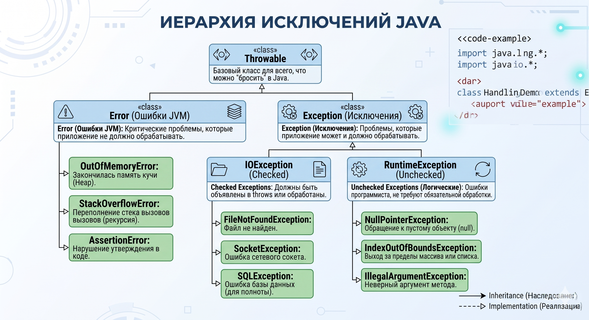

# Исключения (Exceptions)

## Иерархия исключений Java



Вся иерархия исключений в Java берёт начало от одного класса — **`Throwable`**. Это базовый класс для всего, что можно "бросить" (`throw`) и "поймать" (`catch`) в Java. От него отходят две принципиально разные ветки.

## Две ветки: `Error` vs `Exception`

### `Error` — Ошибки JVM (не для нас)

`Error` — это критические проблемы на уровне JVM или операционной системы, которые приложение **не должно** пытаться обработать. Когда возникает `Error`, JVM сигнализирует: "Всё кончено, я не могу продолжать работу нормально". Ловить их через `try-catch` — плохая практика.

Типичные представители:

- **`OutOfMemoryError`** — закончилась память Кучи (Heap). Подробно разбирали в теме [JVM → OOM](basics.md#oom).
- **`StackOverflowError`** — переполнение стека вызовов (бесконечная рекурсия).
- **`AssertionError`** — нарушение утверждения (`assert`) в коде.

### `Exception` — Исключения (наша зона ответственности)

`Exception` — это проблемы, которые приложение **может и должно** обрабатывать. Они делятся на два лагеря, и разница между ними — один из топ-вопросов на собеседованиях.

## Checked vs Unchecked (Главный вопрос собеса)

### Checked Exceptions (Проверяемые)

Наследники `Exception`, **кроме** `RuntimeException` и его потомков.

- **Главное правило:** Компилятор **принудительно** требует их обработки. Если метод может бросить checked exception, ты обязан либо обернуть вызов в `try-catch`, либо объявить его в сигнатуре через `throws`.
- **Философия:** Checked exceptions — это **ожидаемые внешние проблемы**, которые случаются не из-за бага в коде, а из-за внешнего мира. Файл может не существовать, сеть может упасть, база данных может быть недоступна. Java говорит: "Я предупреждаю тебя заранее — подумай, что делать в этой ситуации."

Типичные представители (ветка `IOException`):

- **`FileNotFoundException`** — файл не найден.
- **`SocketException`** — ошибка сетевого соединения.
- **`SQLException`** — ошибка при работе с базой данных.

```java
// Компилятор не пустит без try-catch или throws
public void readFile(String path) throws IOException {
    FileReader reader = new FileReader(path); // бросает FileNotFoundException
}
```

### Unchecked Exceptions (Непроверяемые)

Наследники **`RuntimeException`**.

- **Главное правило:** Компилятор **не требует** их обработки. Ты можешь ловить их — но не обязан.
- **Философия:** Это **ошибки программиста** — баги в логике, которых не должно быть в нормальном коде. Обращение к `null`, выход за пределы массива, неверный аргумент. Компилятор не может предусмотреть все такие случаи, поэтому они "на совести" разработчика.

Типичные представители:

- **`NullPointerException`** — обращение к `null`-ссылке.
- **`IndexOutOfBoundsException`** — выход за пределы массива или списка.
- **`IllegalArgumentException`** — методу передан некорректный аргумент.
- **`IllegalStateException`** — вызов метода в неправильном состоянии объекта.
- **`ClassCastException`** — некорректное приведение типов.
- **`ArithmeticException`** — например, деление на ноль.

## Полная таблица

| | **Error** | **Checked Exception** | **Unchecked Exception** |
|---|---|---|---|
| **Базовый класс** | `Error` | `Exception` (не `RuntimeException`) | `RuntimeException` |
| **Причина** | Критический сбой JVM/ОС | Ожидаемая внешняя проблема | Баг в логике программиста |
| **Компилятор требует обработки?** | ❌ Нет | ✅ Да | ❌ Нет |
| **Ловить через `catch`?** | Крайне редко (почти никогда) | Да, обязательно | По необходимости |
| **Примеры** | `OutOfMemoryError`, `StackOverflowError` | `IOException`, `SQLException` | `NPE`, `IndexOutOfBoundsException` |

## Обработка исключений: try-catch-finally

### Базовая конструкция

```java
try {
    // Код, который может бросить исключение
    String content = readFile("data.txt");
} catch (FileNotFoundException e) {
    // Конкретная ошибка — обрабатываем первой
    log.error("Файл не найден: {}", e.getMessage());
} catch (IOException e) {
    // Более широкая ошибка — обрабатываем второй
    log.error("Ошибка чтения: {}", e.getMessage());
} finally {
    // Выполнится ВСЕГДА — и при ошибке, и без неё
    closeResources();
}
```

!!! warning "Порядок catch имеет значение"
    Более специфичные (дочерние) исключения должны идти **перед** более общими (родительскими). Если поставить `catch (IOException e)` перед `catch (FileNotFoundException e)`, код не скомпилируется — компилятор скажет, что второй блок недостижим.

### Когда `finally` НЕ выполнится?

Это любимый вопрос-засыпка:

1. Если вызвать `System.exit(0)` — JVM убивается принудительно.
2. Если произошёл `OutOfMemoryError` или сбой самой JVM.
3. Если поток был убит снаружи через `Thread.stop()` (deprecated).

### `try-with-resources` (Java 7+) — Современный подход

Вместо того чтобы вручную закрывать ресурсы в `finally`, используй `try-with-resources`. Он автоматически вызывает `close()` у всех ресурсов, которые реализуют `AutoCloseable`.

```java
// Старый способ — многословный и опасный (можно забыть закрыть)
FileReader reader = null;
try {
    reader = new FileReader("data.txt");
    // ...
} finally {
    if (reader != null) reader.close();
}

// Современный способ — чисто и безопасно
try (FileReader reader = new FileReader("data.txt");
     BufferedReader br = new BufferedReader(reader)) {
    String line = br.readLine();
    // reader и br закроются автоматически в обратном порядке
}
```

!!! tip "Правило"
    В современном коде `finally` для закрытия ресурсов — антипаттерн. Всегда используй `try-with-resources`.

## Кастомные исключения

### Когда создавать свои?

Кастомные исключения нужны, когда хочешь:

1. **Нести доменный смысл** — `OrderNotFoundException` говорит больше, чем `RuntimeException("Order not found")`.
2. **Добавить контекст** — передать `orderId`, `userId` и другие данные для логирования.
3. **Разграничить слои** — не пропускать `SQLException` из репозитория в контроллер.

### Checked или Unchecked для своих?

```java
// Checked — если вызывающий код ОБЯЗАН обработать этот случай
public class InsufficientFundsException extends Exception {
    private final BigDecimal required;
    private final BigDecimal available;

    public InsufficientFundsException(BigDecimal required, BigDecimal available) {
        super("Недостаточно средств: требуется %s, доступно %s"
              .formatted(required, available));
        this.required = required;
        this.available = available;
    }
    // геттеры...
}

// Unchecked — если это баг или неожиданное состояние (Spring-стиль)
public class OrderNotFoundException extends RuntimeException {
    public OrderNotFoundException(Long orderId) {
        super("Заказ не найден: id=" + orderId);
    }
}
```

!!! note "Правило в Spring-приложениях"
    В Spring-экосистеме принято использовать **Unchecked** (Runtime) исключения. Это снижает "шум" в сигнатурах методов и избавляет от бесполезных `throws` на каждом уровне стека. Checked исключения из JDK (вроде `IOException`) оборачиваются в unchecked на границе инфраструктурного слоя.

## Обработка исключений в Spring

### `@ControllerAdvice` и `@ExceptionHandler`

В Spring MVC не нужно обворачивать каждый контроллер в `try-catch`. Вместо этого — централизованный обработчик ошибок.

```java
@RestControllerAdvice
public class GlobalExceptionHandler {

    @ExceptionHandler(OrderNotFoundException.class)
    @ResponseStatus(HttpStatus.NOT_FOUND)
    public ErrorResponse handleOrderNotFound(OrderNotFoundException ex) {
        return new ErrorResponse(ex.getMessage(), "ORDER_NOT_FOUND");
    }

    @ExceptionHandler(InsufficientFundsException.class)
    @ResponseStatus(HttpStatus.PAYMENT_REQUIRED)
    public ErrorResponse handleInsufficientFunds(InsufficientFundsException ex) {
        return new ErrorResponse(ex.getMessage(), "INSUFFICIENT_FUNDS");
    }

    // Fallback для всего непойманного
    @ExceptionHandler(Exception.class)
    @ResponseStatus(HttpStatus.INTERNAL_SERVER_ERROR)
    public ErrorResponse handleGeneric(Exception ex) {
        log.error("Неожиданная ошибка", ex);
        return new ErrorResponse("Внутренняя ошибка сервера", "INTERNAL_ERROR");
    }
}
```

### Антипаттерны при работе с исключениями

```java
// ❌ Глотать исключение — худший грех
try {
    riskyOperation();
} catch (Exception e) {
    // ничего не делаем — баг навсегда скрыт
}

// ❌ Логировать И пробрасывать — дублирование в логах
catch (Exception e) {
    log.error("Ошибка", e);
    throw e; // в логах будет два стектрейса об одной ошибке
}

// ❌ Ловить Exception или Throwable без причины
catch (Exception e) { ... } // слишком широко — ловим всё подряд

// ✅ Правильно: ловить конкретное, логировать один раз, пробрасывать с контекстом
catch (IOException e) {
    throw new FileProcessingException("Не удалось обработать файл: " + path, e);
}
```

!!! warning "Никогда не теряй cause"
    При оборачивании исключения всегда передавай оригинал вторым аргументом: `new MyException("message", originalException)`. Иначе теряется стектрейс — и отладка превращается в детективное расследование.