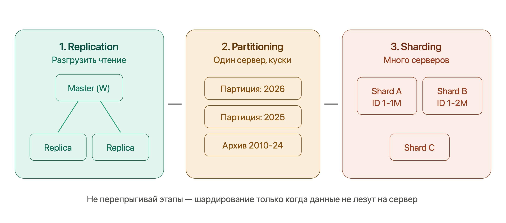

# Системный дизайн (System Design)

## Фундамент

### TCP vs UDP

Два способа передать данные на транспортном уровне.

| | **TCP** | **UDP** |
|---|---|---|
| **Соединение** | Three-way handshake (SYN → SYN-ACK → ACK) | Нет — «выстрелил и забыл» |
| **Гарантии** | Доставка, порядок, переотправка потерянного | Никаких |
| **Цена** | Задержка + overhead | Минимальная |
| **Кто живёт сверху** | HTTP, gRPC, драйверы БД | Видеозвонки, стриминг, игры, DNS, QUIC |

Аналогия: TCP — заказное письмо с уведомлением о вручении, UDP — открытка в почтовый ящик.

### HTTP и HTTPS

HTTP — «запрос → ответ» поверх TCP: метод (GET/POST/PUT/DELETE), заголовки, тело; в ответ — статус-код, заголовки, тело.

!!! info "HTTP — stateless"
    Сервер сам по себе не помнит предыдущие запросы. Состояние живёт в куках/токенах у клиента или выносится в Redis/БД. Именно это свойство — фундамент горизонтального масштабирования (Надёжность и эксплуатация).

HTTPS = HTTP внутри TLS-туннеля: шифрование трафика + аутентификация сервера (сертификат). Цена — дополнительные round-trip'ы на TLS handshake при установке соединения.

### HTTP/1.1 → HTTP/2 → HTTP/3

Вся эволюция — борьба с **Head-of-Line Blocking** (блокировкой головы очереди):

- **HTTP/1.1** — по одному соединению запросы идут строго по очереди. Костыль браузеров: 6 параллельных соединений на домен.
- **HTTP/2** — мультиплексирование: много потоков в одном TCP-соединении, сжатие заголовков (HPACK). Но потеря одного TCP-пакета тормозит **все** потоки — блокировка переехала на уровень TCP.
- **HTTP/3** — QUIC поверх UDP: надёжность и порядок реализованы отдельно для каждого потока, потеря пакета одного потока не трогает остальные. Плюс быстрее устанавливает соединение (шифрование встроено).

!!! tip "Фраза для собеса"
    «HTTP/2 убрал HOL-блокировку на уровне приложения, но она осталась на уровне TCP; HTTP/3 через QUIC поверх UDP убирает её и там».

### DNS

Телефонная книга интернета: имя → IP. Цепочка резолвинга (кэш на каждом шаге, срок — TTL записи):

```
Браузер/ОС (кэш) → Resolver (провайдер, 8.8.8.8) → Root → TLD (.com) → Authoritative (знает IP)
```

Для дизайна важно: DNS агрессивно кэшируется, а geo-DNS (разные IP разным регионам) работает как грубая балансировка нагрузки.

### Что происходит при вводе URL

Классический разминочный вопрос — связывает всё вышеперечисленное:

1. **DNS-резолвинг** — имя → IP (с кэшами по пути)
2. **TCP handshake** — SYN → SYN-ACK → ACK
3. **TLS handshake** — сертификат, обмен ключами (для HTTPS)
4. **HTTP-запрос и ответ** — `GET /` → `200 OK` + HTML
5. **Рендеринг** — браузер парсит HTML, догружает статику (обычно уже с CDN)

Каждый шаг добавляет задержку — отсюда ценность DNS-кэша, keep-alive соединений и CDN.

### REST vs gRPC vs GraphQL

| | **REST** | **gRPC** | **GraphQL** |
|---|---|---|---|
| **Транспорт/формат** | HTTP + JSON | HTTP/2 + Protobuf (бинарный) | HTTP + JSON, один endpoint |
| **Плюсы** | Прост, универсален, HTTP-кэш | Быстрый, компактный, контракт `.proto` + codegen, стриминг | Клиент выбирает поля → нет over/under-fetching |
| **Минусы** | Over-fetching / under-fetching | Нечитаем глазами, слабее в браузере, сложнее дебаг | Сложно кэшировать, N+1, тяжёлые запросы кладут сервер |
| **Когда брать** | Публичные API — дефолт | Внутреннее общение микросервисов | Много разных клиентов с разными нуждами |

### Синхронно vs асинхронно

- **Sync** — вызвал и блокируешься до ответа (обычный REST-вызов). Просто, но связность высокая: получатель тормозит или упал → тормозишь/падаешь и ты.
- **Async** — кинул сообщение в очередь (Kafka/RabbitMQ) и работаешь дальше. Развязка сервисов, буферизация пиков, устойчивость к падениям получателя. Цена: eventual consistency, сложнее отследить результат.

Пример: регистрация пользователя — синхронно (нужен мгновенный ответ), отправка welcome-письма — в очередь.

### Метрики

- **Latency** — время **одного** запроса. Смотрим **перцентили** (p50/p95/p99), а не среднее: p99 = 200 мс значит «1% запросов медленнее 200 мс» — и именно хвост портит UX.
- **Throughput** — запросов в **единицу времени** (QPS/RPS). Latency — про один запрос, throughput — про поток.
- **Availability** — доля времени, когда система работает:

| Девятки | Downtime в год |
|---|---|
| 99% | ~3.65 дня |
| 99.9% | ~8.76 часа |
| 99.99% | ~52 минуты |
| 99.999% | ~5 минут |

Каждая следующая девятка — на порядок дороже. Полезно спросить у интервьюера, какая нужна.

- **Consistency** — все ли клиенты видят одни и те же данные (детально — CAP, Тир 2).
- **Durability** — данные не теряются после подтверждённой записи (репликация на несколько узлов). Не путать с availability: данные могут быть целы, но временно недоступны.

### Back-of-the-envelope estimation

Оценка «на салфетке» — навык, который обосновывает архитектуру числами, а не «на глаз».

**Числа, которые надо помнить:**

- Секунд в сутках ≈ 86 400 (**~10⁵**), в году ≈ **3×10⁷**
- ASCII-символ ≈ 1 байт, UUID ≈ 16 байт, JSON-событие ≈ 1 KB, картинка ≈ 100 KB – 1 MB
- Задержки: RAM — наносекунды, SSD — микросекунды, сеть внутри ДЦ — ~0.5 мс, через океан — ~150 мс

**Алгоритм на примере** (Twitter-подобный сервис, 300M MAU):

1. **QPS**: DAU ≈ 150M, по 2 запроса в день → 300M / 10⁵ ≈ **3000 QPS** в среднем
2. **Пик**: трафик неравномерен, ×2–3 → **~9000 QPS** — мощности проектируем на пик
3. **Read/Write**: соцсеть ≈ 100:1 → ~30 QPS записи и ~3000 чтения → **кэш обязателен**
4. **Хранилище**: 30 твитов/с × 300 байт × 3×10⁷ с ≈ **~270 GB/год** текста; с медиа и репликацией ×3 — терабайты → **шардирование**

!!! tip "Смысл шага"
    Не точное число, а порядок величины + архитектурный вывод из него: «100:1 → кэш», «терабайты → шардинг», «99.99% → репликация». Округляй агрессивно, считай вслух — оценивают ход рассуждения.

---

## Строительные блоки

### Load Balancing — балансировка нагрузки

Балансировщик — регулировщик на перекрёстке. Стоит перед серверами, распределяет трафик так, чтобы ни один сервер не упал от перегрузки, пока другие простаивают, и убирает из ротации мёртвые узлы по **health-check**. Основа горизонтального масштабирования и высокой доступности.

#### L4 vs L7 — самый частый вопрос

| | **L4 (Transport — TCP/UDP)** | **L7 (Application — HTTP/HTTPS)** |
|---|---|---|
| **Что видит** | Только IP и порт | URL, заголовки, cookie, тело |
| **Скорость** | Очень быстрый | Медленнее (распаковка пакета) |
| **Ресурсы** | Минимум CPU/памяти | Больше CPU/памяти |
| **Возможности** | Просто перекидывает пакеты | Роутинг по URL, SSL termination, кэш |
| **Пример решения** | "Отправь на сервер 2" | "/images → файловый сервер, /api → бэкенд" |

L4 — "глупый, но быстрый". L7 — "умный, но дороже": терминирует SSL (расшифровывает HTTPS на уровне балансировщика) и роутит по содержимому.

#### Алгоритмы балансировки

**Round Robin (Карусель)** — запросы раздаются по очереди: серверу 1, 2, 3, снова 1. Подходит когда серверы одинаковы и запросы примерно равны по нагрузке. Версия Weighted Round Robin даёт мощному серверу больший "вес".

**Least Connections** — трафик идёт на сервер с наименьшим числом активных подключений. Нужен для "тяжёлых" долгих запросов (скачивание файлов, WebSocket, сложные отчёты), где Round Robin может добить уже занятый сервер.

**IP hash / Consistent hashing** — один клиент всегда попадает на один сервер (без sticky-куки). Про consistent hashing подробно — ниже в шардировании.

#### Sticky Sessions (Липкие сессии)

Пользователь залогинился, сессия в памяти Сервера А. Следующий запрос балансировщик кинул на Сервер Б — пользователь "разлогинился". Sticky Sessions привязывают клиента к одному серверу через cookie.

!!! warning "Антипаттерн"
    1. Нарушается равномерность — на одном сервере скапливается много юзеров. 2. Если сервер падает, все "прилипшие" к нему теряют сессии. **Правильное решение** — хранить сессии не в памяти, а в Redis (тогда любой сервер обслужит любого юзера).

!!! tip "Стандартный первый ход в дизайне"
    «Ставим L7-балансировщик с health-check'ами перед пулом **stateless**-серверов, сессии — в Redis».

---

### Caching — кэширование

Две цели: снизить latency и разгрузить БД. При read:write 100:1 (типичная соцсеть) кэш решает почти всё.

**Уровни** (hit на любом → дальше не идём): браузер (`Cache-Control`, `ETag`) → CDN → кэш приложения (Redis/Memcached) → БД (источник истины, до неё доходят только промахи).

#### Паттерны кэширования

**Cache-Aside (Lazy Loading)** — приложение сначала идёт в кэш. Hit → отдаём. Miss → идём в БД, кладём в кэш, отдаём. В Spring — `@Cacheable`. Кэшируется только то, что реально запрашивают. Если кэш упадёт — система выживёт (пойдёт в БД напрямую).

**Write-Through (Сквозная запись)** — пишем всегда в кэш, кэш синхронно пишет в БД. Ответ — только когда сохранилось в обоих местах. В кэше всегда свежие данные, но запись медленнее.

**Write-Behind (Отложенная запись)** — пишем в кэш и сразу получаем ОК. Кэш асинхронно сбрасывает в БД пачками. Молниеносная запись (идеально для счётчиков просмотров/лайков), но если кэш сгорит до сброса — данные потеряны.

#### Стратегии вытеснения (Eviction)

- **LRU (Least Recently Used)** — выкидывает то, к чему дольше всего не обращались. Золотой стандарт. Вчерашняя статья уйдёт, освободив место сегодняшней горячей.
- **LFU (Least Frequently Used)** — выкидывает то, к чему обращались меньше всего раз. Хорошо для статических справочников, плохо для трендов.
- **TTL** — по истечении времени жизни; обычно комбинируется с LRU.

#### Инвалидация

Как не отдавать устаревшее после изменения в БД: короткий TTL либо явное удаление/обновление ключа при записи. Недаром шутка: «в программировании две сложные вещи — инвалидация кэша и придумывание имён».

#### Cache Stampede (Thundering Herd)

```
Главная страница закэширована с TTL = 5 минут.
12:00:00 — TTL истёк, кэш пуст.
12:00:01 — заходят 1000 юзеров одновременно.
Все 1000 потоков видят Cache Miss → одновременно бьют тяжёлым SQL в БД.
База ложится от перегрузки.
```

!!! tip "Как лечить"
    **Mutex/Lock** — когда кэш протухает, только один первый поток получает право сходить в БД (захватывает лок). Остальные 999 либо ждут, либо получают чуть устаревшую копию (Stale Data), пока первый не обновит. Знакомо из многопоточности Java. Альтернатива — probabilistic early expiration (вероятностное раннее обновление до истечения TTL).

#### Redis vs Memcached vs Hazelcast

Memcached — простой key-value кэш в памяти. Redis — богаче: структуры данных (списки, sorted sets), персистентность, pub/sub — дефолтный выбор сегодня. Дальше — нюансы кластеризации:

| | **Redis** | **Hazelcast** |
|---|---|---|
| **Что это** | In-Memory Data Structure Store (C) | In-Memory Data Grid (Java) |
| **Шардирование** | 16 384 хэш-слота по Master-узлам | 271 партиция, у каждого узла основные + backup |
| **Маршрутизация** | Smart Clients (Lettuce/Jedis знают карту) | P2P, узлы равны |
| **Killer-фича** | Скорость, простота | Data Locality — EntryProcessor выполняется на узле с данными |
| **Консистентность** | AP по умолчанию | AP + CP Subsystem (Raft) для надёжных локов |

**Redis Cluster:** нет центрального узла, все общаются по Gossip-протоколу. Клиент сам знает, что `user:123` лежит на Узле 2 (через хэш-слот). Если карта устарела — узел ответит `MOVED`, клиент обновит карту. У Master есть Replica, при падении — голосование и promotion реплики.

**Hazelcast Data Locality:** чтобы обновить зарплату миллиону сотрудников, в Redis пришлось бы тащить миллион записей по сети. В Hazelcast отправляешь маленький `EntryProcessor` (кусок Java-кода) внутрь кластера — он выполнится прямо на узлах с данными. Сеть не нагружается.

---

### Базы данных: SQL vs NoSQL

**SQL** (Postgres, MySQL) — строгая схема, связи через внешние ключи, JOIN'ы, транзакции ACID. Бери, когда: структурированные данные со сложными связями, важна согласованность (деньги, заказы), объём умеренный.

**NoSQL** — зонтик из четырёх типов, каждый заточен под свой паттерн доступа:

- **Key-value** (Redis, DynamoDB) — «ключ → значение», молниеносно. Кэши, сессии, простые lookup'ы.
- **Document** (MongoDB) — JSON-документы, гибкая схема. Каталоги, профили.
- **Column-family** (Cassandra) — гигантские объёмы, write-heavy, линейно масштабируется. Логи, метрики, лента.
- **Graph** (Neo4j) — узлы и связи. Соцграф, рекомендации.

!!! warning "Антипаттерн"
    NoSQL «потому что модно». Без чётко известного паттерна доступа, под который база заточена, получишь боль без выгоды. SQL по умолчанию — NoSQL под конкретную причину.

**Индексы** — B-дерево: чтение по колонке из полного перебора превращается в быстрый поиск. Расплата — место на диске и **замедление записи** (каждый INSERT/UPDATE обновляет и индекс). Индексируем то, по чему ищем/сортируем, а не всё подряд.

**ACID**: **A**tomicity — всё или ничего (списание + зачисление вместе); **C**onsistency — из валидного состояния в валидное; **I**solation — параллельные транзакции не мешают (уровни: read committed / repeatable read / serializable); **D**urability — закоммичено → не потеряется.

---

### Масштабирование БД: три этапа



Три этапа. Нельзя сразу шардировать — особенно на простом MVP.

#### 1. Replication (Репликация)

```
              ┌──────────┐
   Запись ──→ │  Master  │ ──── async replication ────┐
              └──────────┘                            │
                                            ┌─────────┴─────────┐
                                            ▼                   ▼
                                      ┌──────────┐        ┌──────────┐
                              Чтение  │ Replica  │        │ Replica  │  Чтение
                                      └──────────┘        └──────────┘
```

Master принимает запись (INSERT/UPDATE/DELETE), реплики — только чтение (SELECT). Разгружает Master, даёт High Availability (если Master умер — реплика становится новым Master).

!!! warning "Replication Lag"
    Копирование с Master на реплику занимает время (миллисекунды, под нагрузкой — секунды). Асинхронно. Проблема: записал данные → тут же прочитал → а их ещё нет на реплике. Решение для критичных чтений: читать из Master (Read-Your-Writes consistency).

Дополнения:

- **Master-Master** — писать можно в несколько узлов (запас по записи, гео-распределение). Плата — **конфликты записи** (два узла изменили одно по-разному), которые надо разрешать (например, last-write-wins по timestamp).
- **Sync vs async репликация**: синхронная — master ждёт подтверждения реплик перед ответом (durability, но медленно); асинхронная — отвечает сразу (быстро, но lag и риск потерять хвост незареплицированных записей при падении master).

#### 2. Partitioning (Партиционирование)

!!! info "Главное правило"
    Партиционирование происходит на **ОДНОМ сервере** (внутри одной БД).

**Горизонтальное (по строкам)** — бьём гигантскую таблицу на партиции по правилу (например, по месяцам). Для приложения таблица одна (`news`), но физически январь хранится отдельно от февраля. Ищем за март — БД не трогает январь.

**Вертикальное (по столбцам)** — выносим тяжёлые колонки (`avatar_image_bytes`, `huge_bio_text`) в отдельную таблицу `user_details` (1-к-1), оставляя в основной только частые `id`, `name`, `email`. Кэш БД скажет спасибо.

#### 3. Sharding (Шардирование)

Когда данные не лезут на один сервер — ставим несколько. Данные размазываются по узлам на основе **Shard Key**. Юзеры ID 1–1M на Сервере А, 1M–2M на Сервере Б.

!!! danger "Почему шардирование — это ад"
    1. **JOIN-ы умирают** — нельзя сделать JOIN между таблицами на разных серверах. Джоины переезжают в Java-код.
    2. **Распределённые транзакции** — перевод денег между серверами не покрыть обычным `BEGIN...COMMIT`. Привет, 2PC или Saga.
    3. **Ребалансировка** — Сервер А заполнился → добавляем Сервер В → нужно без остановки продакшена перенести часть данных.

**Выбор Shard Key** — ключевое решение, от него зависит равномерность:

- **Range-based** (по диапазону: дата, id, алфавит) — просто, удобны диапазонные запросы, но легко получить перекос: весь свежий трафик бьёт в один шард.
- **Hash-based** (хэш от ключа) — равномерно, но диапазонные запросы («все заказы за март») размазаны по всем шардам — дорого.

!!! warning "Hotspot (горячая точка)"
    Один шард получает непропорционально много трафика. Классика — «звёздный» пользователь: шард знаменитости с миллионами подписчиков раскаляется. Лечится подмешиванием суффикса в ключ или выделением таких сущностей отдельно.

#### Consistent Hashing

Проблема наивного `hash(key) % N`: добавили/убрали сервер → изменился N → **почти все ключи** переехали на новые места. Для кэша это тотальный miss, для шардов — массовая перебалансировка.

Решение — **кольцо**: диапазон значений хэша замыкаем в круг, серверы — точки на нём (по хэшу имени), каждый ключ обслуживает первый сервер по часовой стрелке. Добавление/удаление узла двигает только **соседний участок** ключей — малую долю, а не всё.

Для равномерности каждый физический сервер представлен множеством **виртуальных узлов** (много точек на кольце).

Где живёт: распределённые кэши, Cassandra, DynamoDB. 16 384 хэш-слота Redis Cluster и 271 партиция Hazelcast — инженерные вариации той же идеи.

---

### Message Queues — очереди сообщений

Посредник для асинхронного общения: producer кладёт сообщение, consumer забирает в своём темпе. Даёт **развязку** (сервисы не знают друг о друге), **буферизацию** (пик оседает в очереди, а не роняет получателя), **устойчивость** (получатель упал — сообщения ждут).

Две модели:

- **Point-to-point (queue)** — сообщение получает **один** consumer из группы → распределение задач (обработать платёж, отправить письмо).
- **Pub/Sub (topic)** — получают **все** подписчики → события («заказ создан» → склад, аналитика, почта).

| | **RabbitMQ** | **Kafka** |
|---|---|---|
| **Суть** | Классический брокер очередей | Распределённый лог событий |
| **Сообщения** | Удаляются после подтверждения | Хранятся, можно перечитать заново |
| **Сильная сторона** | Гибкая маршрутизация, модель «сделай задачу» | Гигантский throughput, стриминг событий, event sourcing |

#### Dead Letter Queue (DLQ)

!!! warning "Проблема Poison Pill"
    Консьюмер читает очередь. Приходит сломанный JSON. Парсер падает. Сообщение не подтверждено. Брокер думает "консьюмер не справился, дам ещё раз" — и так бесконечно. Очередь встаёт из-за одного сообщения.

**Решение:** Retry Policy (3 попытки с растущей задержкой 1с/3с/10с). Если после 3 раз всё ещё ошибка — брокер перекидывает сообщение в DLQ. Основная очередь работает дальше, дефектные сообщения в DLQ разбирают разработчики или по ним стреляют алерты.

---

### CDN (Content Delivery Network)

Сеть географически распределённых edge-серверов, кэширующих статику (картинки, видео, JS/CSS) рядом с пользователем. Физика: запрос через океан ~150 мс, до ближайшего edge — единицы мс.

- **Pull** — CDN сам тянет контент с origin при первом промахе и кэширует (дефолт, просто). **Push** — заливаешь контент заранее сам (контроль).
- Бонусы: разгрузка origin-сервера, TLS-терминация на краю, защита от DDoS.

В дизайне любой системы с картинками/видео CDN появляется по умолчанию.

---

## Теория распределённых систем

### CAP-теорема

- **C (Consistency)** — каждый клиент видит самые последние данные или ошибку. Никто не видит устаревшую версию.
- **A (Availability)** — любой живой узел всегда отвечает (без ошибки).
- **P (Partition tolerance)** — система работает даже если сеть между узлами порвалась.

!!! tip "Суть компромисса"
    В реальном мире сеть ломается **всегда**. P — это не опция, а реальность. Поэтому выбор всегда между **C и A в момент аварии**.

При обрыве связи между дата-центрами:

**CP-система (выбираем Consistency)** — запрещаем запись/чтение на изолированном узле. Пользователь видит "Ошибка 500" (жертвуем A), но никто не прочитает устаревшую финансовую сводку. _Примеры: MongoDB, HBase, Redis Cluster в строгом режиме, ZooKeeper/etcd._

**AP-система (выбираем Availability)** — узел продолжает отвечать из того, что у него есть. Сайт работает, но данные могут быть устаревшими (жертвуем C). Это **Eventual Consistency** — когда сеть починят, узлы синхронизируются. _Примеры: Cassandra, DynamoDB, Hazelcast._

!!! tip "Фраза для собеса"
    «Поскольку P неизбежно, вопрос — чем жертвуем при разделении: для корзины/закладок берём AP, для платежей — CP».

### PACELC — жизнь без аварий

CAP описывает только момент аварии. Но 99.9% времени сеть работает. PACELC:

```
IF Partition (сеть порвалась):  выбирай между A и C
ELSE (сеть работает):           выбирай между L (Latency) и C (Consistency)
```

Сеть в порядке, юзер публикует срочный пресс-релиз:

- **Выбрал Latency** — узел быстро записал к себе, мгновенно ответил ОК. Молниеносно. Но пока данные асинхронно летят на другие узлы, кто-то прочитает старую версию.
- **Выбрал Consistency** — узел записал, дождался записи на всех узлах, потом ответил ОК. Идеальная согласованность, но задержка огромная.

### Модели согласованности

Спектр гарантий — от строгих (медленно, координация) к слабым (быстро):

- **Strong (линеаризуемость)** — любое чтение видит последнюю запись, как будто копия одна. Деньги, остатки товара на складе.
- **Causal** — причинно-связанные события все видят в правильном порядке: ответ на комментарий не появится раньше самого комментария. Независимые события могут расходиться.
- **Read-your-writes** — **свои** изменения видишь всегда, даже если чужие ещё догоняют. Лечит «написал коммент → обновил страницу → его нет» при replication lag.
- **Monotonic reads** — данные не «прыгают назад во времени»: раз увидел значение — более старое уже не покажут.
- **Eventual** — реплики расходятся ненадолго, но сойдутся. Лайки, лента, счётчики просмотров.

Искусство дизайна — выбрать **минимально достаточную** модель под каждую операцию, а не тащить strong везде.

### Консенсус: Raft / Paxos

Задача: узлы должны договориться об одном значении или порядке операций, несмотря на сбои узлов и сети. **Paxos** — классика, знаменит труднопонятностью; **Raft** сделан понятным. Интуиция Raft:

1. Узлы выбирают **лидера** (leader election).
2. Лидер принимает все записи, упорядочивает и реплицирует.
3. Запись принята, когда её подтвердило **большинство (кворум, N/2+1)**.

Следствия:

- Кластеры делают **нечётного размера** (3, 5) — большинство определяется однозначно.
- Кластер переживает падение меньшинства узлов, но встаёт без большинства.
- Два конфликтующих решения не могут победить одновременно — любые два большинства пересекаются.

Где живёт: etcd, ZooKeeper, Consul, выбор нового Master при failover, CP Subsystem в Hazelcast. Самому реализовывать не надо — надо понимать, что внутри этих систем и зачем.

---

### Гарантии доставки и идемпотентность

- **At-most-once** — доставим максимум раз, без ретраев. Можно терять. Некритичные метрики.
- **At-least-once** — ретраим до подтверждения → возможны **дубликаты**. Дефолт брокеров (Kafka, RabbitMQ).
- **Exactly-once** — ровно один раз. End-to-end дорог и труднодостижим.

!!! tip "Главная формула"
    **Exactly-once на практике = at-least-once доставка + идемпотентная обработка.** Смиряемся с дубликатами на доставке, но делаем обработку безопасной к повтору.

**Идемпотентность** — повторное выполнение = однократному по эффекту: `GET` и `set(x=5)` идемпотентны, `increment(x)` — нет. Приём для API — **idempotency key**: клиент шлёт уникальный id запроса, сервер запоминает обработанные и на повтор возвращает прежний результат, не выполняя операцию заново (так работают платёжные API — Stripe: при ретрае деньги не спишутся дважды).

#### Idempotent Consumer

Брокеры дают **At-least-once** — одно сообщение может прилететь дважды из-за рестартов или сетевых задержек. Идемпотентность — повторная обработка не создаёт дублей побочных эффектов (юзер не получит три одинаковых письма).

```java
@KafkaListener(topics = "news-published")
@Transactional
public void onNewsPublished(NewsPublishedEvent event) {
    // Способ 1: проверка по Idempotency Key
    if (processedEventRepository.existsById(event.getEventId())) {
        return; // уже обрабатывали — игнорируем
    }

    sendEmails(event);
    processedEventRepository.save(new ProcessedEvent(event.getEventId()));

    // Способ 2 (надёжнее): UNIQUE constraint в БД
    // При дубликате → DataIntegrityViolationException → ловим, коммитим offset
}
```

---

### Распределённые транзакции

Бизнес-операция размазана по сервисам/БД («оформить заказ» = склад + платёж + доставка), а единого `BEGIN...COMMIT` поверх них нет.

#### Two-Phase Commit (2PC)

Координатор в две фазы: спрашивает всех «готовы закоммитить?» (prepare) → если **все** ответили «да» — командует «commit». Даёт атомарность, но:

- **Блокирующий**: пока идёт голосование, участники держат локи. Умер координатор между фазами → участники зависли с заблокированными ресурсами.
- Плохо масштабируется, режет availability.

Поэтому в микросервисах 2PC почти не используют — используют Saga.

#### Saga

Бизнес-процесс размазан по микросервисам, единого `ROLLBACK` нет. Saga решает через **компенсирующие транзакции** (шаги отмены): цепочка локальных транзакций, у каждой есть компенсация. Шаг 3 упал → компенсируем шаги 2 и 1 («вернуть товар на склад», «отменить платёж»).

**Choreography (Хореография)** — сервисы общаются событиями, нет центра. А сохранил → кинул ивент. Б поймал → обновил → кинул ивент. Если В падает — кидает `FailedEvent`, А и Б ловят и компенсируют.

- ➕ Слабая связность, нет единой точки отказа.
- ➖ При 4+ сервисах логику невозможно отследить — спагетти.

**Orchestration (Оркестрация)** — центральный оркестратор (стейт-машина) шлёт команды: "А, сохрани" → ждёт → "Б, обнови" → ждёт. Если В вернул ошибку — оркестратор шлёт А и Б команды отката.

- ➕ Весь флоу в одном месте, легче мониторить.
- ➖ Оркестратор — единая точка отказа, может обрасти сложной логикой.

!!! warning "Saga не даёт изоляции"
    В середине саги система в промежуточном состоянии (платёж прошёл, доставки ещё нет) — это eventual consistency, дизайн должен это учитывать.

#### Transactional Outbox

!!! warning "Проблема Dual Write"
    Редактор публикует новость. Нужно: 1) сохранить в PostgreSQL, 2) отправить событие в Kafka. Если сначала БД, а Kafka моргнёт — сервисы не узнают. Если сначала Kafka, а БД упадёт — фантомное событие без данных.

**Решение:** в той же транзакции БД пишем во вторую табличку `outbox_events`:

```sql
BEGIN;
INSERT INTO news_metadata (id, title) VALUES (1, 'Новый листинг');
INSERT INTO outbox_events (id, aggregate_type, payload)
    VALUES (100, 'News', '{...json...}');
COMMIT;
-- Транзакция гарантирует: либо всё, либо ничего
```

Отдельный фоновый процесс (часто Debezium, читающий WAL-логи БД) сканирует `outbox_events` и надёжно перекладывает сообщения в Kafka. Ушло — удаляется из outbox.

---

### Микросервисы vs монолит

**Монолит** — одно разворачиваемое приложение: проще разрабатывать, деплоить и тестировать на старте, единая БД и обычные ACID-транзакции. Минусы приходят с ростом: нельзя масштабировать отдельные части, команды мешают друг другу, один стек навсегда.

**Микросервисы** — независимые сервисы: отдельный деплой и масштабирование, автономия команд, свобода стека. Цена: сетевая сложность, распределённые транзакции (см. выше), сложная наблюдаемость, ops-overhead.

!!! danger "Distributed monolith"
    Худший исход: разбили на сервисы, но они так связаны, что деплоятся только вместе — минусы обоих миров. Зрелый ответ на собесе: «начинаем с монолита, выделяем сервисы под конкретную причину (масштаб, автономия команд), а не рефлекторно».

Поддерживающие детали:

- **API Gateway** — единая точка входа для клиентов: маршрутизация к сервисам, аутентификация, rate limiting, агрегация ответов. Клиент общается с gateway, а не с десятком сервисов.
- **BFF (Backend For Frontend)** — эволюция Gateway: отдельный лёгкий сервис под конкретного клиента (один для веба, другой для мобилки). Вместо 10 запросов с фронта к складу/биллингу/профилю — 1 запрос к BFF, который сам всё соберёт по микросервисам и вернёт готовый JSON под конкретный экран.
- **Service Discovery** — реестр живых инстансов (Eureka, Consul): сервисы находят друг друга, когда инстансы постоянно появляются/исчезают при автоскейлинге.

_Внутреннее устройство отдельного сервиса — DDD, Hexagonal, CQRS/Event Sourcing — вынесено в конспект «Архитектура приложения»._

---

### Rate Limiting

Ограничение частоты запросов: защита от абьюза и брутфорса, честное распределение ресурсов, контроль затрат. Классическая задача дизайна сама по себе.

| Алгоритм | Суть | Особенность |
|---|---|---|
| **Fixed window** | Счётчик на фиксированное окно (100/мин) | Проблема границы: 100 в конце минуты + 100 в начале следующей = 200 за пару секунд |
| **Sliding window log** | Храним timestamp каждого запроса | Точно, но ест память |
| **Sliding window counter** | Взвешенный гибрид текущего и прошлого окна | Хороший прод-баланс точности и памяти |
| **Token bucket** | Токены капают со скоростью R, запрос тратит токен | **Разрешает всплески** до размера ведра |
| **Leaky bucket** | Запросы «вытекают» с постоянной скоростью | **Выравнивает** поток, всплесков не допускает |

!!! tip "Различие, которое спрашивают"
    Token bucket допускает burst (накопил токены — потратил разом), leaky bucket выравнивает поток в ровный темп.

**Распределённый лимитер**: при многих инстансах счётчик должен быть общим, иначе каждый лимитит по-своему → атомарные инкременты в **Redis**.

---

## Надёжность и эксплуатация

Аксиома распределённых систем: **всё рано или поздно падает** — сеть моргает, сервисы тормозят, диски умирают. Дизайн — не «как избежать сбоев», а «как выжить при них». В Java-мире эти паттерны собраны в **Resilience4j**.

### Resilience-паттерны

**Timeout** — базовое и часто забываемое: никогда не жди ответа бесконечно. Зависшие вызовы копят потоки/соединения, и медленный сосед вешает твой сервис.

**Retry + exponential backoff + jitter** — повтор при временном сбое, но с умом:

- Пауза растёт экспоненциально (1с → 2с → 4с) — даём сервису восстановиться.
- **Jitter** (рандом в паузе) — иначе все клиенты ретраят синхронно и добивают лежащий сервис (**retry storm / thundering herd**).
- Ретраить — только **идемпотентные** операции (иначе дважды спишешь деньги).

```java
@Retry(name = "bankApi")
// application.yml:
// resilience4j.retry.bankApi.max-attempts: 4
// resilience4j.retry.bankApi.wait-duration: 1s
// resilience4j.retry.bankApi.exponential-backoff-multiplier: 2
```

**Circuit Breaker (предохранитель)** — самый важный паттерн, три состояния:

```
CLOSED ──(error rate > порог)──→ OPEN ──(пауза)──→ HALF-OPEN
HALF-OPEN ──(пробные прошли)──→ CLOSED
HALF-OPEN ──(снова ошибки)──→ OPEN
```

- **Closed** — работаем, считаем ошибки.
- **Open** — мгновенно отклоняем запросы, не дёргая мёртвый сервис: fail fast, не тратим ресурсы, даём упавшему передышку.
- **Half-open** — пропускаем несколько пробных.

Смысл одной фразой: *предохранитель не даёт локальному сбою превратиться в каскадный отказ всей системы*.

```java
// Resilience4j — стандарт де-факто в Java
@CircuitBreaker(name = "bankApi", fallbackMethod = "fallbackBonus")
public BonusResult calculateBonus(Long userId) {
    return bankApiClient.getBonus(userId); // может зависнуть
}

// Fallback — когда предохранитель открыт
public BonusResult fallbackBonus(Long userId, Throwable t) {
    log.warn("Банк недоступен, возвращаем дефолт", t);
    return BonusResult.empty();
}
```

**Bulkhead (переборка)** — как отсеки корабля: отдельные пулы потоков/соединений на каждую зависимость. Вызовы к сервису А зависли и выели свой пул → вызовы к Б живут на своём. Без переборок один медленный dependency вешает всё приложение.

**Graceful degradation / fallback** — урезанный, но рабочий ответ вместо 500: упал сервис рекомендаций → страница товара без блока «похожие». Часто реализуется как fallback у circuit breaker (в open отдаём кэш/дефолт). Разница между «сайт лагает» и «сайт лежит».

### Observability (наблюдаемость)

Нельзя чинить то, что не видишь. Три столпа:

- **Metrics** — числовые агрегаты: QPS, latency (**p50/p95/p99**, не среднее!), error rate, CPU/память, глубина очередей. Prometheus + Grafana; в Java — Micrometer через Spring Boot Actuator.
- **Logs** — события. В распределёнке — **структурированные** (JSON) и централизованные (ELK: Elasticsearch+Logstash+Kibana, или Loki), иначе логи 30 сервисов бесполезны.
- **Traces** — путь запроса через сервисы: **trace id** протаскивается через все вызовы, каждый участок — span с таймингом. OpenTelemetry, Jaeger/Zipkin. Отвечает на «запрос прошёл 8 сервисов — где затык?».

!!! tip "Золотые сигналы (Google SRE)"
    **Latency, Traffic, Errors, Saturation** — мониторь четыре, покроешь большинство проблем. Алерты — по симптомам для пользователя (медленно, ошибки), а не по каждой мелочи — иначе alert fatigue и их игнорируют.

**Health checks**: **liveness** (жив ли процесс — если нет, оркестратор рестартует) vs **readiness** (готов ли принимать трафик — прогрет кэш, есть коннект к БД). Spring Actuator `/health`.

**Sidecar (коляска мотоцикла)** — паттерн деплоя в Kubernetes: бизнес-логика — «мотоцикл», логирование/метрики/проксирование — «коляска», отдельный контейнер в том же поде (общие сеть и диск, изоляция по процессам). Java-приложение просто пишет в stdout, sidecar собирает и отправляет дальше — тяжёлая инфраструктура логирования не тащится в код.

```
┌─────────── Pod ───────────┐
│  [Java App]   [Sidecar]   │
│   пишет в      Fluentbit   │
│   stdout    →  собирает    │
│                → ElasticSearch
└───────────────────────────┘
```

### Масштабирование

- **Вертикальное (scale up)** — мощнее сервер (CPU/RAM). Просто, но потолок железа, дорого наверху, единая точка отказа.
- **Горизонтальное (scale out)** — больше серверов за балансировщиком. Дефолтный путь. Требование — stateless.

!!! tip "Stateless — король"
    Сервер не хранит состояние клиента в своей памяти: сессии — в Redis/БД или в JWT у клиента. Тогда любой сервер обслужит любого юзера, инстансы взаимозаменяемы → свободный scale out и **autoscaling** (добавлять/убивать инстансы по CPU/QPS). Фраза для собеса: «делаем серверы stateless, состояние в Redis — горизонтальное масштабирование становится тривиальным».

**Load shedding** — при перегрузке осознанно отбросить часть запросов (или низкоприоритетные), чтобы корректно обслужить остальные. Лучше отказать 5%, чем деградировать на 100%.

### Специализированные хранилища (polyglot persistence)

Под разные задачи — разные хранилища:

- **Object storage** (S3, GCS) — большие бинарники: картинки, видео, бэкапы. Паттерн: **файлы не в БД** — в базе только ключ/URL, сам файл в S3, раздача через CDN. **Presigned URL** — клиент грузит файл напрямую в S3 по временной подписанной ссылке, минуя твой бэкенд.
- **Time-series** (Prometheus, InfluxDB, TimescaleDB) — метрики, IoT, котировки: поток записи + агрегаты по временным диапазонам.
- **Search** (Elasticsearch/OpenSearch) — полнотекстовый поиск, который SQL делает плохо (`LIKE '%слово%'` не масштабируется, нет релевантности/опечаток). Внутри — **инвертированный индекс** (слово → документы). Паттерн: истина в SQL, копия для поиска в ES, синхронизация через события.
- **Geo** — «найди ближайшее» (такси, доставка): **geohash** (близкие точки → общий префикс строки) или quadtree/R-tree. Из коробки: Redis GEO, PostGIS.

### Безопасность в дизайне

- **AuthN vs AuthZ**: аутентификация — *кто ты* (логин/пароль, токен); авторизация — *что тебе можно* (права). Сначала первое, потом второе — не путать.
- **Sessions vs JWT**:

| | **Сессии (в Redis)** | **JWT** |
|---|---|---|
| **Состояние** | На сервере (session id в куке) | В самом токене (stateless) |
| **Отзыв** | Мгновенный (удалил из стора) | Трудный до истечения → короткий TTL access + refresh token |
| **Масштабирование** | Нужен общий стор | Идеально для scale out — сервер проверяет только подпись |

!!! warning "JWT подписан, но НЕ зашифрован"
    Содержимое токена читается любым — секретов внутри не хранить.

- **OAuth 2.0 / OpenID Connect** — делегированный доступ («Войти через Google»): приложение получает токен, не видя пароль. OAuth 2.0 — авторизация (доступ к ресурсам), OIDC — аутентификация поверх (кто пользователь). В Java — Spring Security OAuth2.
- **Шифрование**: in transit (TLS — обязательно) и at rest (диски БД, бэкапы). Пароли — только хэш с солью (bcrypt/argon2). Секреты/ключи — в Vault / Secrets Manager, не в коде.

---

## Собеседование

### Методология: 6 шагов (~40 минут)

Провалы чаще случаются не от незнания, а от структуры: кандидат прыгает в детали БД, не выяснив, что строим. Держи каркас по порядку — он же чек-лист вслух.

**1. Требования (~5 мин).** Никакого кода и квадратиков!

- **Функциональные** — что система делает: только списываем/начисляем? Нужна история? Бронирование?
- **Нефункциональные** — в каких условиях: RPS? Критична ли latency? Что важнее — Availability или Consistency?
- Явно **сузь скоуп**: «фокусируюсь на X и Y, Z отмечу как расширение» — сигнал зрелости.

!!! tip "Для ERP/финансов ответ всегда — Consistency"
    Лучше система выдаст ошибку, чем продаст один товар двум людям.

**2. Оценка масштаба (~5 мин).** Back-of-the-envelope из Тира 0: QPS средний и пиковый, read:write, объём на годы. Из чисел — архитектурные выводы: «100:1 → кэш», «терабайты → шардинг». Не пропускай — этот шаг обосновывает всё дальнейшее.

**3. API (~5 мин).** Пара ключевых эндпоинтов — контракт системы:

```
POST /api/v1/inventory/reserve     — забронировать товар
GET  /api/v1/inventory/{item_id}   — получить остатки
```

Покажи понимание версионирования, идемпотентности (что будет, если клиент дважды вызовет POST из-за лага?), правильных HTTP-статусов.

**4. Модель данных + High-Level Design (~10 мин).** Рассуждай вслух: «Выбираю реляционную БД, потому что нужны строгие гарантии целостности и джоины для отчётов». Обсуди индексы; для критичных данных — append-only история / Event Sourcing (аудит). Затем крупные блоки и поток данных:

```
Клиент → API Gateway → Warehouse Service → PostgreSQL (транзакция)
                              │
                              ▼
                         Event Bus (Kafka)
                              │
              ┌───────────────┼───────────────┐
              ▼               ▼               ▼
        Billing Service  Analytics      Notification
```

**5. Deep Dive (~10 мин).** Интервьюер начнёт ломать систему: _"А что если сервер упадёт после записи в БД, но до отправки в Kafka?"_ Здесь блистаешь: **Transactional Outbox**, **идемпотентность консьюмеров**, выбор shard key, стратегия кэша.

**6. Bottlenecks и trade-offs (~5 мин).** Сам подними слабые места: единые точки отказа, hotspot'ы, поведение на пике. **Главный сигнал сеньорности** — показать, что у каждого выбора есть цена, и ты её видишь.

!!! tip "Три золотых правила"
    1. **Думай вслух.** Молчать 5 минут и выдать идеал хуже, чем 5 минут рассуждать вслух о компромиссах и выдать решение с небольшим изъяном.
    2. **Нет серебряной пули.** Каждое решение имеет плюсы и минусы — озвучивай их.
    3. **Озвучивай компромиссы:** "Redis для остатков даст скорость, но риск stale data — поэтому для чекаута идём в master-базу".

---

### Разбор: URL Shortener (типа bit.ly)

Эталонный проход по методологии.

**1. Требования.** Функциональные: укоротить URL; редиректить по короткому. Расширения (проговорить и отложить): кастомные алиасы, TTL ссылки, аналитика кликов. Нефункциональные: крайне **read-heavy**; редирект — **очень быстрый**; высокая **availability** (редиректы лежат = все ссылки мертвы); коды уникальны.

**2. Масштаб.** 100M новых ссылок/мес → запись ≈ **40 QPS**. Read:write 100:1 → чтение ≈ **4000 QPS** (пик ~10 000) → **агрессивный кэш**. Хранилище: запись ~500 байт × 6 млрд за 5 лет ≈ **~3 ТБ** → закладываем **шардирование**. Длина кода: base62 (a–z, A–Z, 0–9), 62⁷ ≈ 3.5 трлн → **7 символов** хватит с запасом.

**3. API.**

```
POST /shorten          body: { longUrl } → { shortUrl }
GET  /{shortCode}      → 301/302 redirect на longUrl
```

!!! tip "301 vs 302 — классический trade-off"
    **301 (permanent)** кэшируется браузером → быстрее, но клики мимо тебя — аналитики нет. **302 (temporary)** — каждый клик идёт к тебе → есть аналитика, чуть медленнее. Нужна аналитика → 302.

**4. High-level.** Клиент → LB → stateless-сервис → Redis (cache-aside) → БД. Запись: сгенерировать код, сохранить пару. Чтение: кэш → miss → БД → положить в кэш → редирект.

**5. Deep dive — генерация кода** (сюда копают в первую очередь):

- **А: хэш URL (MD5) + 7 символов.** Просто, но **коллизии** → проверка в БД и перегенерация — лишние чтения при записи.
- **Б: глобальный счётчик + base62.** Уникально без коллизий, но общий счётчик — узкое место и точка отказа при многих серверах.
- **В (лучший): Key Generation Service с диапазонами.** Отдельный сервис (или Redis/ZooKeeper) выдаёт серверам **диапазоны** id пачками (A: 1–1000, B: 1001–2000). Сервер раздаёт коды локально из своего диапазона → нет общего счётчика на каждый запрос, коллизии невозможны в принципе.

**5б. Deep dive — хранилище и кэш.** Паттерн доступа — точечный lookup `shortCode → longUrl`, без связей и транзакций → **идеальный кейс для key-value NoSQL** (DynamoDB/Cassandra), тривиально шардится. Шардирование — hash по `shortCode` (диапазонные запросы не нужны — минус hash-шардинга не мешает). Кэш — Redis, LRU: популярные ссылки живут в кэше, hit rate высокий.

**6. Bottlenecks.**

- Редирект — критический путь: кэш обязателен; очень «горячие» ссылки — на CDN/edge.
- KGS — точка отказа → реплицируем + серверы держат запас предвыданного диапазона.
- Hotspot (вирусная ссылка) → сглаживают кэш и CDN.
- Аналитика кликов — **не синхронно** в пути редиректа: событие в Kafka, обработка асинхронно.

---

### Классические задачи и их «фокус»

Каждую задачу спрашивают ради конкретного приёма — готовя задачу, качай именно его:

| Задача | Ради чего спрашивают |
|---|---|
| **URL shortener** | Генерация уникальных ключей (KGS + диапазоны), кэш, 301 vs 302 |
| **Pastebin** | То же + object storage (S3) для больших текстов, TTL, приватность |
| **Rate limiter** | Алгоритмы (token bucket и др.), распределённый счётчик в Redis |
| **News feed / Twitter** | **Fan-out on write vs on read**, гибрид для «звёзд», eventual consistency |
| **Чат / мессенджер** | WebSocket (persistent connections), доставка и порядок сообщений, presence |
| **Uber / такси** | Геоиндексы (geohash/quadtree), real-time обновления локаций, матчинг |
| **YouTube / Netflix** | Загрузка → транскодинг через очередь → CDN, адаптивный стриминг (HLS/DASH) |
| **Google Drive / Dropbox** | Чанкинг файлов, дедупликация, синхронизация, разрешение конфликтов |
| **Автокомплит** | Префиксное дерево (trie) + топ-K, прекомпьют популярных подсказок |
| **Нотификации** | Очереди с приоритетами, идемпотентность, ретраи, DLQ |
| **Distributed cache** | Consistent hashing во всей красе, репликация, LRU |

!!! info "Fan-out за 30 секунд"
    **On write (push)**: при публикации поста раскладываем его в ленты всех подписчиков → чтение мгновенно, но пост звезды с 50M фолловеров = 50M записей. **On read (pull)**: собираем ленту в момент запроса → запись дёшево, чтение дорого. **Гибрид** — стандартный ответ: push для обычных пользователей, pull для звёзд.

---

## Разбор кейсов

### Кейс 1: Round Robin убивает один сервер

**Проблема:** 3 сервера генерируют PDF-отчёты, L4 + Round Robin, трафик равномерный, но один сервер регулярно падает от OOM, два других на 20%.

**Решение:** Round Robin раздаёт запросы вслепую, не зная их веса. Генерация PDF — тяжёлая долгая операция. Если на один сервер случайно попало несколько "тяжёлых" PDF-запросов подряд, они копятся, а Round Robin продолжает слать новые. Заменить на **Least Connections** (увидит что сервер занят) или перейти на **L7** для роутинга по типу запроса. Тяжёлые PDF лучше вообще вынести в асинхронную очередь.

### Кейс 2: База падает в 10:10, Redis-узел сгорел в 10:05

**Проблема 1 — что убило базу в 10:10:** **Cache Stampede (Thundering Herd)**. TTL = 10 минут, кэш создан в 10:00, истёк в 10:10. Тысячи брокеров одновременно получили Cache Miss и одновременно ударили в PostgreSQL. Лечить — mutex (один поток обновляет кэш) или вероятностное раннее обновление (probabilistic early expiration).

**Проблема 2 — почему смерть Redis в 10:05 не положила кэш:** В Redis Cluster у Master есть Replica. Узлы заметили падение по Gossip, проголосовали, повысили реплику до Master. Но репликация **асинхронная** — если Master принял запись и сгорел до репликации, эти данные могли потеряться (для кэша не критично — пересоберётся из БД).

### Кейс 3: DevOps хочет шардировать 100M строк

**Проблема:** Таблица `kase_news` — 100M строк за 15 лет. Бизнес: "новости 2026 мгновенно, на архивы плевать". DevOps: "шардируем по `year`, 15 серверов".

**Решение:** Шардирование — пушка по воробьям. Получим всю боль (распределённые джоины, ребалансировка) ради задачи, решаемой на одном сервере:

1. **Горизонтальное партиционирование** по `year` — БД физически разделит данные, запрос за 2026 не тронет архивы. Свежие данные = маленькая горячая партиция в RAM.
2. **Вертикальное партиционирование** — вынести тяжёлое тело статьи в отдельную таблицу, оставив в основной `id`, `title`, `date` для быстрых списков.

### Кейс 4: Экскаватор перерубил кабель Алматы–Астана

**Проблема:** Сервис "Избранное", БД в двух дата-центрах, Network Partition.

**Решение:** Для закладок выбираем **AP (Availability)**. Цена ошибки низкая — ну увидит юзер свой список закладок на секунду неактуальным. В момент аварии: оба дата-центра продолжают принимать запросы, юзер добавляет закладки, они сохраняются локально. После починки сети — Eventual Consistency, узлы синхронизируются (конфликты решаются, например, по timestamp). PACELC при рабочей сети: тоже выбираем **L (Latency)** — мгновенный отклик важнее идеальной согласованности для такой некритичной фичи.

### Кейс 5: Потерянные и дублированные письма

**Проблема:** News сохраняет в БД и шлёт `NewsPublished` в Kafka, EmailSender рассылает письма. Баги: 1) события теряются, 2) приходит по 3 письма, 3) сломанный JSON блокирует очередь.

**Решение — три паттерна:**

1. **Transactional Outbox** (потеря событий) — сохранять новость и событие в одну транзакцию БД, воркер надёжно перекладывает в Kafka.
2. **Idempotent Consumer** (дубли писем) — проверять `event_id` перед отправкой, UNIQUE constraint в БД.
3. **Dead Letter Queue** (poison pill) — после 3 retry перекидывать битое сообщение в DLQ, очередь работает дальше.

---

## Итоговая шпаргалка

| **Тема** | **Запомнить** |
|---|---|
| **TCP vs UDP** | TCP — handshake, гарантии, порядок. UDP — быстро, без гарантий (стриминг, DNS, QUIC) |
| **HTTP/2 vs HTTP/3** | /2 — мультиплексирование, но HOL остался в TCP. /3 — QUIC поверх UDP, HOL убран |
| **REST / gRPC / GraphQL** | Наружу / между сервисами (скорость) / гибкость для разных клиентов |
| **Latency** | Смотри p99, не среднее — хвост портит UX |
| **Availability** | 99.9% ≈ 8.8 ч/год; 99.99% ≈ 52 мин/год. Каждая девятка — на порядок дороже |
| **Estimation** | Сутки ~10⁵ с, год ~3×10⁷ с; пик = ×2–3; из чисел — архитектурные выводы |
| **L4 vs L7** | L4 — IP/порт, быстро. L7 — URL/заголовки, умный роутинг + SSL termination |
| **RR vs Least Connections** | RR — равные запросы. LC — тяжёлые долгие запросы |
| **Sticky Sessions** | Антипаттерн. Лучше — сессии в Redis |
| **Cache-Aside** | Читай кэш → miss → БД → положи в кэш. Spring `@Cacheable` |
| **Write-Through vs Write-Behind** | Through — синхронно, свежо. Behind — async, быстро, риск потери |
| **LRU vs LFU** | LRU — давно не трогали. LFU — мало раз трогали |
| **Cache Stampede** | Толпа на истёкший TTL. Лечить mutex-локом / ранним обновлением |
| **Consistent Hashing** | Кольцо: новый узел двигает только соседний участок. Виртуальные узлы для равномерности |
| **Replication** | Master пишет, реплики читают. Replication Lag → read-your-writes с master |
| **Partitioning** | Один сервер. Горизонтальное (строки) / вертикальное (столбцы) |
| **Sharding** | Много серверов. Боль: джоины, распределённые транзакции, ребаланс. Hotspot от «звёзд» |
| **SQL vs NoSQL** | SQL — связи, ACID, дефолт. NoSQL — масштаб + известный паттерн доступа |
| **CAP** | Сеть рвётся всегда → выбор C vs A в аварию. CP — деньги, AP — корзина/закладки |
| **PACELC** | Без аварии — выбор между Latency и Consistency |
| **Consistency-модели** | Strong → causal → read-your-writes → eventual. Бери минимально достаточную |
| **Consensus** | Кворум N/2+1, кластеры нечётные (3/5), Raft — etcd/ZooKeeper/Consul |
| **Доставка** | Брокеры = at-least-once → дубли. Exactly-once = at-least-once + идемпотентность |
| **Idempotent Consumer** | Проверка event_id / UNIQUE constraint. Idempotency key в платёжных API |
| **Transactional Outbox** | Бизнес-данные + событие в одну транзакцию. Решает Dual Write |
| **DLQ** | Poison pill → retry → Dead Letter Queue, очередь живёт |
| **Saga** | Компенсации вместо rollback. Choreography vs Orchestration. Изоляции НЕТ |
| **2PC** | Атомарно, но блокирующий и хрупкий — в микросервисах избегают |
| **Rate Limiting** | Token bucket — всплески ок. Leaky — ровный поток. Счётчик — в Redis |
| **Retry** | Только идемпотентные + exponential backoff + jitter (иначе retry storm) |
| **Circuit Breaker** | Closed → Open → Half-Open. Fail fast против каскадного отказа |
| **Bulkhead** | Изолируй пулы потоков по зависимостям |
| **Sidecar** | Логи/метрики/прокси — в соседнем контейнере пода, не в коде приложения |
| **BFF** | Отдельный бэкенд под конкретный фронт: 1 запрос → готовый JSON для экрана |
| **Stateless** | Сессии в Redis/JWT → любой сервер обслужит любого → свободный scale out |
| **JWT vs Sessions** | JWT — stateless, но трудно отозвать (короткий TTL + refresh). Подписан ≠ зашифрован |
| **Object storage** | Файлы в S3 (+presigned URL для прямой загрузки), в БД только ключ, раздача через CDN |
| **301 vs 302** | 301 кэшируется браузером (быстро, без аналитики). 302 — каждый клик к тебе |
| **Fan-out** | On write — быстрое чтение, дорого для звёзд → гибрид push+pull |
| **Методология** | Требования → числа → API → high-level → deep dive → bottlenecks. Думай вслух |